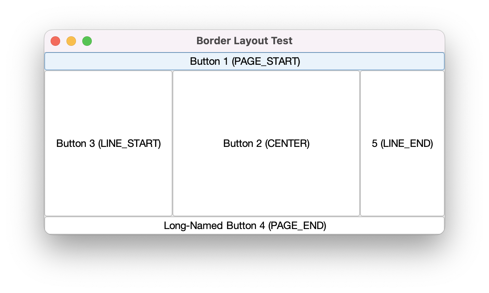
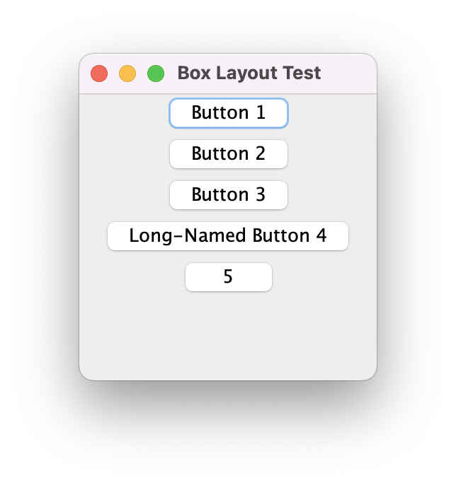
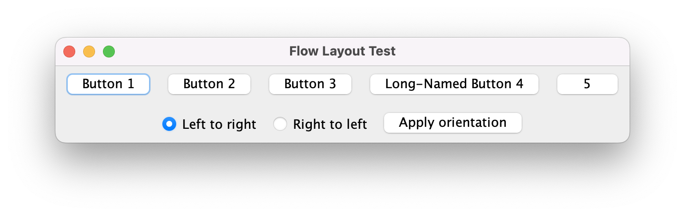
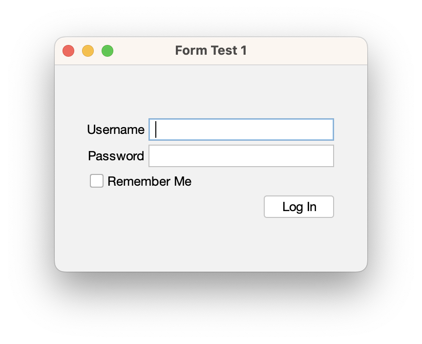
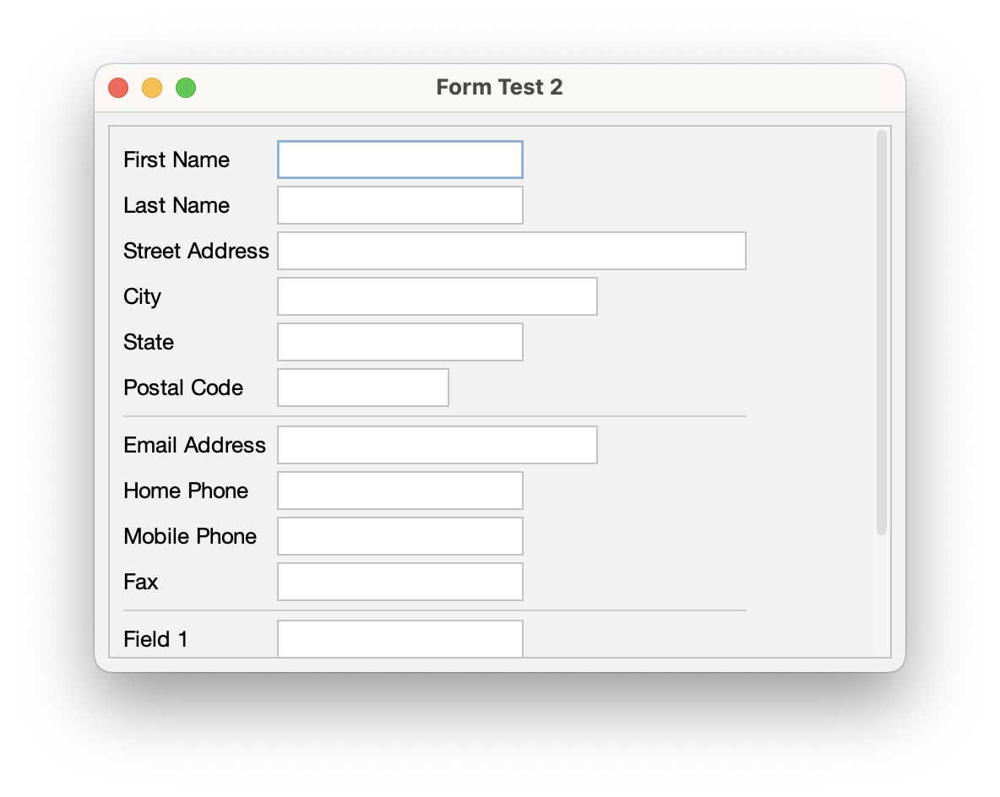
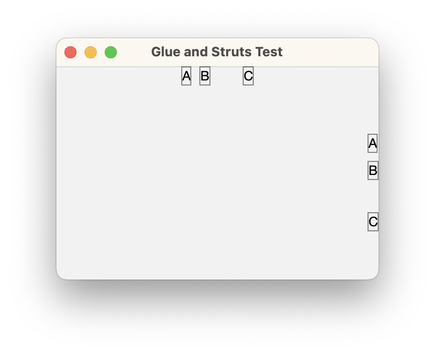

[](https://github.com/HTTP-RPC/Sierra/releases)
[](https://repo1.maven.org/maven2/org/httprpc/sierra/)
[](https://javadoc.io/doc/org.httprpc/sierra)

# Introduction
Sierra is an open-source framework for simplifying development of Java Swing applications. It provides a convenient DSL for declaratively instantiating Swing component hierarchies. The framework is extremely lightweight (8KB) and has no external dependencies. 

The project's name comes from the nautical _S_ or _Sierra_ flag, representing the first letter in "Swing":


This guide introduces the Sierra framework and provides an overview of its key features.

# Contents
* [Getting Sierra](#getting-sierra)
* [Sierra Classes](#sierra-classes)
* [Examples](#examples)
* [Additional Information](#additional-information)

# Getting Sierra
Sierra is distributed via Maven Central at [org.httprpc:sierra](https://repo1.maven.org/maven2/org/httprpc/sierra/). Java 11 or later is required.

# Sierra Classes
Sierra provides the `SwingUIBuilder` class, whose methods can be used to declaratively establish a hierarchy of user interface elements. The methods provided by this class form a DSL, or "domain-specific language", that makes it easy to visualize the resulting output. 

`SwingUIBuilder` includes a set of static methods for declaring common layout containers:

* `borderPanel()` - declares a panel with a border layout
* `horizontalBoxPanel()` - declares a panel with a horizontal (x-axis) box layout
* `verticalBoxPanel()` - declares a panel with a vertical (y-axis) box layout
* `gridBagPanel()` - declares a panel with a grid bag layout
* `flowPanel()` - declares a panel with a flow layout

Additionally, `SwingUIBuilder` provides this method for defining a panel's contents:

```java
public static <C extends Component> Cell<C> cell(C component) { ... }
```

The returned `Cell` instance can be used to further customize the layout or configuration of the provided component:

* `span()` - applies a column span to a grid bag panel cell
* `weightXBy()` - applies a horizontal weight to a grid bag panel cell
* `weightYBy()` - applies a vertical weight to a grid bag panel cell
* `anchorTo()` - applies an anchor to a grid bag panel cell
* `fill()` - applies a fill to a grid bag panel cell
* `with()` - accepts a callback that can be used to set properties or invoke methods on the cell's component

The following methods also return a `Cell` instance and can be used to declare the contents of a border panel:

* `center()`
* `pageStart()`
* `pageEnd()`
* `lineStart()`
* `lineEnd()`

These methods can be used to declare spacer cells:

* `horizontalStrut()`
* `verticalStrut()`
* `horizontalGlue()`
* `verticalGlue()`

For example, the following code creates a flow panel containing a button instance. The button is associated with a simple action handler that writes a message to the console:

```java
JPanel flowPanel = new JPanel(new FlowLayout());

JButton button = new JButton("Press Me");

button.addActionListener(event -> System.out.println("Button pressed"));

flowPanel.add(button);

setContentPane(flowPanel);
```

Using `SwingUIBuilder`, the code could be rewritten as follows:

```java
setContentPane(flowPanel(
    cell(new JButton("Press Me"))
        .with(button -> button.addActionListener(event -> System.out.println("Button pressed")))
));
```

In this simple example, both versions are fairly readable. However, with more deeply nested component hierarchies, the first approach can quickly become untenable. Using `SwingUIBuilder`, the declaration of sub-components mirrors the resulting hierarchy, making it much easier to read and write. 

## ScrollingKeyboardFocusManager
Sierra additionally provides the `ScrollingKeyboardFocusManager` class, which can be used to ensure that components are automatically scrolled into view when focused:

```java
KeyboardFocusManager.setCurrentKeyboardFocusManager(new ScrollingKeyboardFocusManager());
```

# Examples
This section includes examples demonstrating usage of `SwingUIBuilder` with the [Flat](https://github.com/JFormDesigner/FlatLaf) look-and-feel.

## Border Layout
Based on the [border layout](https://docs.oracle.com/javase/tutorial/uiswing/layout/border.html) tutorial example.

[BorderLayoutTest.java](https://github.com/HTTP-RPC/Sierra/blob/master/sierra-test/src/main/java/org/httprpc/sierra/BorderLayoutTest.java)



## Box Layout
Based on the [box layout](https://docs.oracle.com/javase/tutorial/uiswing/layout/box.html) tutorial example.

[BoxLayoutTest.java](https://github.com/HTTP-RPC/Sierra/blob/master/sierra-test/src/main/java/org/httprpc/sierra/BoxLayoutTest.java)



## Flow Layout
Based on the [flow layout](https://docs.oracle.com/javase/tutorial/uiswing/layout/flow.html) tutorial example.

[FlowLayoutTest.java](https://github.com/HTTP-RPC/Sierra/blob/master/sierra-test/src/main/java/org/httprpc/sierra/FlowLayoutTest.java)



## Login Form
[FormTest1.java](https://github.com/HTTP-RPC/Sierra/blob/master/sierra-test/src/main/java/org/httprpc/sierra/FormTest1.java)



## Contact Form
[FormTest2.java](https://github.com/HTTP-RPC/Sierra/blob/master/sierra-test/src/main/java/org/httprpc/sierra/FormTest2.java)



## Glue and Struts
[GlueAndStrutsTest.java](https://github.com/HTTP-RPC/Sierra/blob/master/sierra-test/src/main/java/org/httprpc/sierra/GlueAndStrutsTest.java)



## Grid
[GridTest.java](https://github.com/HTTP-RPC/Sierra/blob/master/sierra-test/src/main/java/org/httprpc/sierra/GridTest.java)


# Additional Information
This guide introduced the Sierra framework and provided an overview of its key features. For additional information, see the [source code](https://github.com/HTTP-RPC/Sierra/tree/master/sierra/src/main/java/org/httprpc/sierra).
