[](https://github.com/HTTP-RPC/Sierra/releases)
[](https://central.sonatype.com/artifact/org.httprpc/sierra/versions)
[](https://javadoc.io/doc/org.httprpc/sierra)

# Introduction
Sierra is an open-source framework for simplifying development of Java Swing applications. It is extremely lightweight and has minimal external dependencies. The project's name comes from the nautical _S_ or _Sierra_ flag, representing the first letter in "Swing":


Sierra provides the `UILoader` class, which can be used in conjunction with the following types to declaratively establish a hierarchy of user interface elements:

* `ColumnPanel` - arranges components in a vertical line
* `RowPanel` - arranges components in a horizontal line
* `FormPanel` - arranges components in a labeled grid
* `StackPanel` - sizes components to fill the available space
* `Spacer` - provides fixed or flexible space between other components

These classes offer an alternative to the standard Java layout managers, which can often be limiting or difficult to use in practice.

Sierra also includes the `TextPane` and `ImagePane` components, which provide an alternative to `JLabel` for displaying basic text or image content, respectively. `TextPane` supports wrapping without requiring HTML, and `ImagePane` supports scaling without requiring an intermediate `BufferedImage`. Some common [utility components](#utility-components) are included as well.

For example, the following markup declares a column panel containing a graphic and a simple greeting:

```xml
<?xml version="1.0" encoding="UTF-8"?>

<!DOCTYPE column-panel SYSTEM "sierra.dtd">

<column-panel padding="8" opaque="true" background="white">
    <image-pane image="world.png" scaleMode="fill-width"/>
    <text-pane text="Hello, World!" horizontalAlignment="center"/>
</column-panel>
```

This markup could be deserialized and set as the content pane of a frame or dialog as follows:

```java
setContentPane(UILoader.load(this, "GreetingTest.xml"));
```

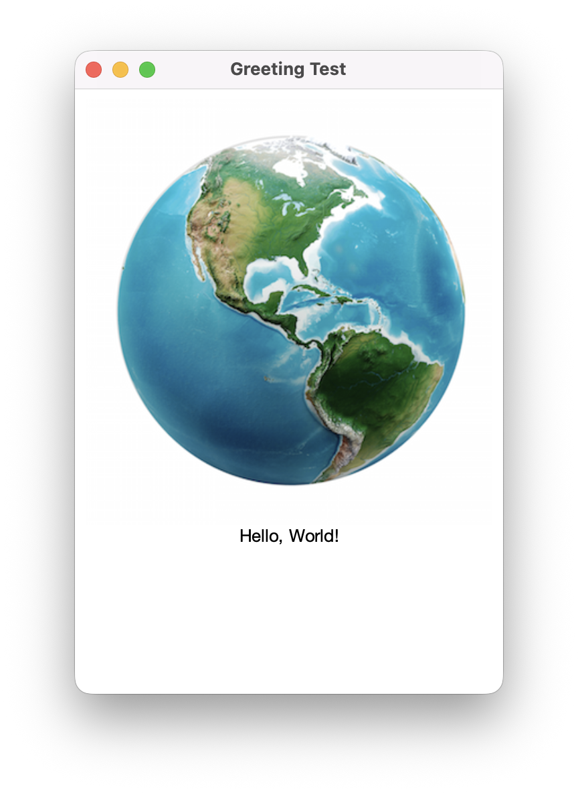

The same result could be achieved programmatically as shown below. However, the markup version is less verbose and more readable:

```java
var columnPanel = new ColumnPanel();

columnPanel.setBorder(new EmptyBorder(8, 8, 8, 8));

columnPanel.setOpaque(true);
columnPanel.setBackground(Color.WHITE);

var imagePane = new ImagePane();

try (var inputStream = getClass().getResourceAsStream("world.png")) {
    imagePane.setImage(ImageIO.read(inputStream));
} catch (IOException exception) {
    throw new RuntimeException(exception);
}

imagePane.setScaleMode(ImagePane.ScaleMode.FILL_WIDTH);

columnPanel.add(imagePane);

var textPane = new TextPane("Hello, World!");

textPane.setHorizontalAlignment(HorizontalAlignment.CENTER);

columnPanel.add(textPane);
```

The complete source code for this example can be found [here](sierra-test/src/main/java/org/httprpc/sierra/test/GreetingTest.java).

Sierra is distributed via Maven Central at [org.httprpc:sierra](https://central.sonatype.com/artifact/org.httprpc/sierra/versions). Java 21 or later is required. [FlatLaf](https://www.formdev.com/flatlaf/) is recommended.

A [DTD](sierra.dtd) is provided to assist with editing. It is not used for validation and is not required.

# Elements
XML elements represent component instances. Most Swing and all Sierra components are supported by default. Support for additional elements can be added via the `bind()` method of the `UILoader` class.

Elements can be nested to create a component hierarchy. For example:

```xml
<column-panel spacing="8" padding="8" opaque="true">
    <column-panel>
        <check-box text="checkBox1"/>
        <check-box text="checkBox2"/>
    </column-panel>

    <row-panel spacing="8">
        <button name="button" text="executeTask"/>
        <label name="label" foreground="gray"/>
        <spacer weight="1"/>
        <activity-indicator name="activityIndicator" indicatorSize="18"/>
    </row-panel>
</column-panel>
```

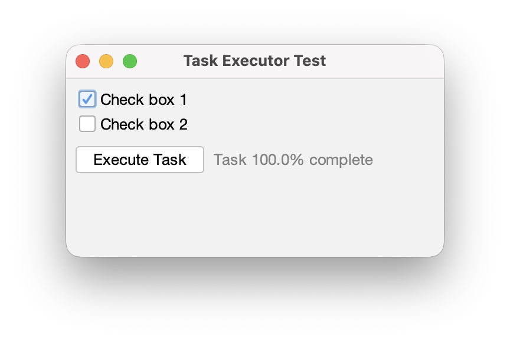

# Attributes
XML attributes generally represent component properties. For example, this markup sets the "text" and "horizontalAlignment" properties of a `TextPane` instance:

```xml
<text-pane text="Hello, World!" horizontalAlignment="center"/>
```

Numeric and boolean values are specified via their string representations. Supported constants and enum values are specified in [kebab case](https://en.wikipedia.org/wiki/Letter_case#Kebab_case).

An optional resource bundle may be provided as the third argument to the `load()` method of `UILoader`. When specified, attributes representing string values are considered resource keys and are used to look up the associated values in the bundle.

## Element Names
The "name" attribute associates an identifier with a component. In addition to setting the "name" property, `UILoader` injects the component itself into an "outlet" defined by the document's owner, the value passed as the first argument to the `load()` method.

For example, this markup declares outlets named "greetingButton" and "greetingLabel":

```xml
<button name="greetingButton" text="prompt"/>
<label name="greetingLabel" horizontalAlignment="center"/>
```

When the call to `load()` returns, the corresponding fields will be populated with the instances declared in the markup. Though not required, use of the `Outlet` annotation is recommended:

```java
public class ActionTest extends JFrame implements Runnable {
    private @Outlet JButton greetingButton = null;
    private @Outlet JLabel greetingLabel = null;

    private static final ResourceBundle resourceBundle = ResourceBundle.getBundle(ActionTest.class.getName());

    ...

    @Override
    public void run() {
        setContentPane(UILoader.load(this, "ActionTest.xml", resourceBundle));

        greetingButton.addActionListener(event -> sayHello());

        ...
    }

    private void sayHello() {
        greetingLabel.setText(resourceBundle.getString("greeting"));
    }

    ...
}
```

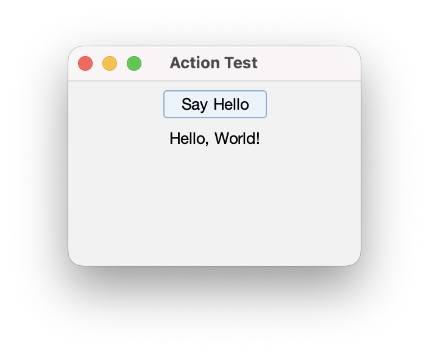

## Color and Font Values
Color and font properties can be specified using the formats supported by `Color#decode()` and `Font#decode()`, respectively. For example, this markup creates an instance of `RowPanel` and sets its "background" property to white:

```xml
<row-panel spacing="8" padding="16" opaque="true" background="#ffffff">
    ...
</row-panel>
```

Colors and fonts can also be specified by name. The name can refer to either a value provided by Swing's UI defaults or a value defined by `UILoader`:

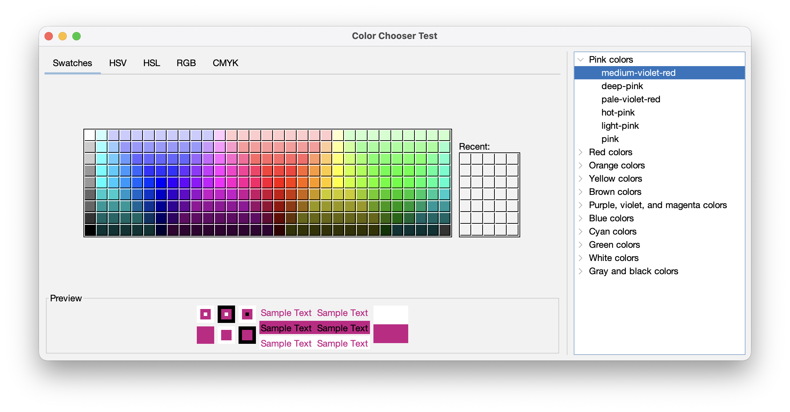

Sierra supports the complete set of [extended web colors](https://en.wikipedia.org/wiki/Web_colors#Extended_colors) by default. Additional named colors and fonts can be added via the `define()` methods of the `UILoader` class.

Opacity can be specified as a value between 0 and 1:

```
red; 0.5
```

## Image and Icon Values
Image and icon properties are specified via a path relative to the document's owner. For example:

```xml
<image-pane image="world.png" scaleMode="fill-width"/>
```

Icon support is currently limited to SVG documents and requires the [FlatLaf Extras](https://github.com/JFormDesigner/FlatLaf/tree/main/flatlaf-extras) library:

```xml
<toggle-button name="alignLeftButton"
    icon="icons/format_align_left_24dp.svg"
    style="buttonType: toolBarButton"
    group="alignment"/>
```

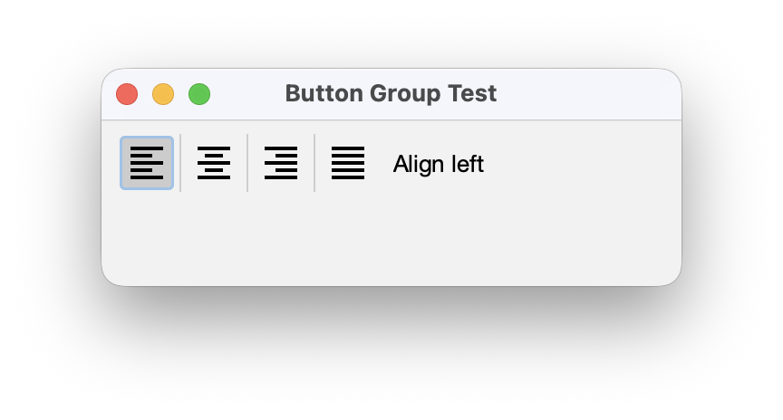

Icons automatically adapt to the current theme:

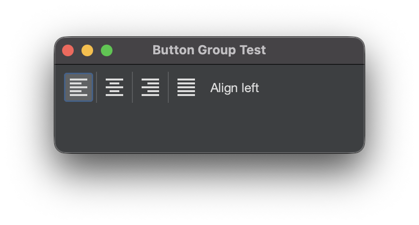

Custom dimensions can be specified either as _path; size_ or _path; width, height_:

```xml
icon="icons/home_24dp.svg; 18"
```

## Title Values
The "title" attribute establishes a titled border around a component:

```xml
<column-panel title="Options">
    <radio-button text="One" group="options" selected="true"/>
    <radio-button text="Two" group="options"/>
    <radio-button text="Three" group="options"/>
</column-panel>
```

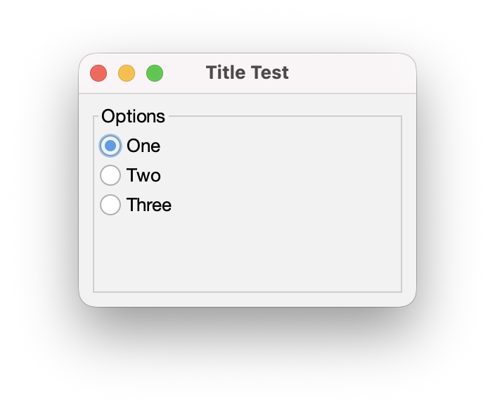

The "titleColor", "titleFont", "titleJustification", and "titlePosition" attributes can be used to customize the title's appearance.

## Border and Padding Values
The "border" and "padding" attributes create a line border and reserve space around a component, respectively. They can also be used to customize the appearance of a titled border.

For example, this markup creates a label with a light gray border and four pixels of padding on each side:

```xml
<label text="pageStart" horizontalAlignment="center" border="silver" padding="4"/>
```

Border thickness, style, and corner radius can be specified as shown below:

```xml
<image-pane image="lighthouse.jpg" scaleMode="fill-height" border="green, 2, solid, 16"/>
```


The default border thickness is 1. Style options include "solid" (the default), "dashed", and "dotted". The default corner radius is 0.

Padding values for multiple sides can be specified in _top_, _left_, _bottom_, _right_ order:

```xml
padding="8, 16, 8, 16"
```

## Weight and Size Values
The "weight" attribute specifies the amount of excess space in a container that should be allocated to a component, relative to other weighted components in the container. When applied to a `Spacer` instance, it creates a "glue" component that automatically shrinks or stretches depending on the size of its container. However, weights are not limited to spacers and can be applied to any component type:

```xml
<column-panel spacing="4" padding="8" opaque="true">
    <label text="pageStart" horizontalAlignment="center" border="silver" padding="4"/>

    <row-panel spacing="4" weight="1">
        <label text="lineStart" font="h2" horizontalAlignment="center" border="silver" padding="4"/>
        <label text="center" font="h1" horizontalAlignment="center" border="silver" padding="4" weight="1"/>
        <label text="lineEnd" font="h2" horizontalAlignment="center" border="silver" padding="4"/>
    </row-panel>

    <label text="pageEnd" horizontalAlignment="center" border="silver" padding="4"/>
</column-panel>
```

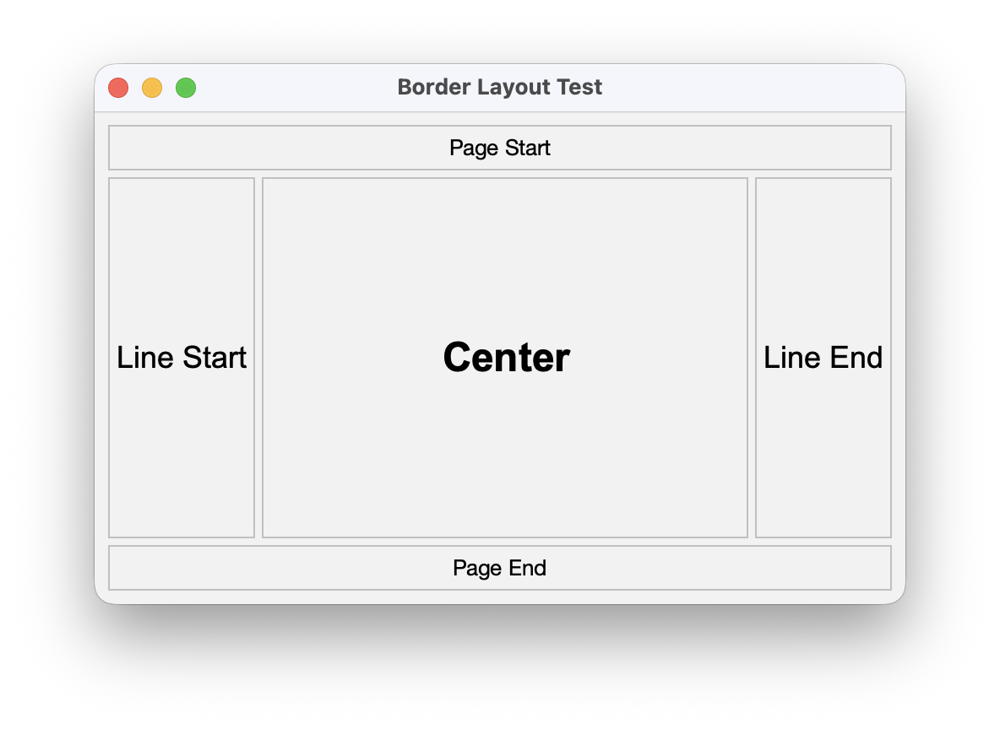

The "size" attribute specifies a fixed dimension for a component. It is typically used with `Spacer` instances to create "struts" between components, as an alternative to the "spacing" property provided by `RowPanel` and `ColumnPanel`:

```xml
<column-panel spacing="4" padding="8" opaque="true">
    <row-panel>
        <button text="1a"/>
        <spacer size="4"/>
        <button text="1b"/>
        <spacer size="4"/>
        <button text="1c"/>
        <spacer weight="1"/>
    </row-panel>
    
    ...
</column-panel>
```

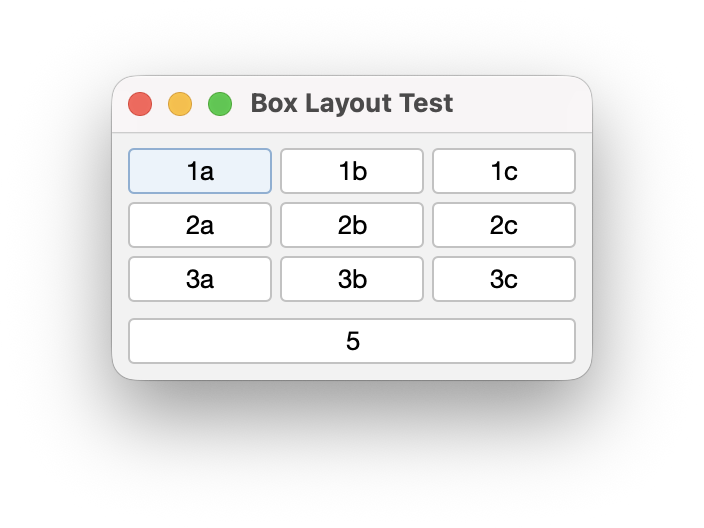

Size values for multiple dimensions can be specified in _width_, _height_ order:

```xml
size="20, 20"
```

## Label Values
The "label" attribute associates a description with a form field. For example:

```xml
<form-panel padding="8" opaque="true">
    <text-field label="firstName" columns="12"/>
    <text-field label="lastName" columns="12"/>
    <text-field label="streetAddress" columns="24"/>

    ...
</form-panel>
```

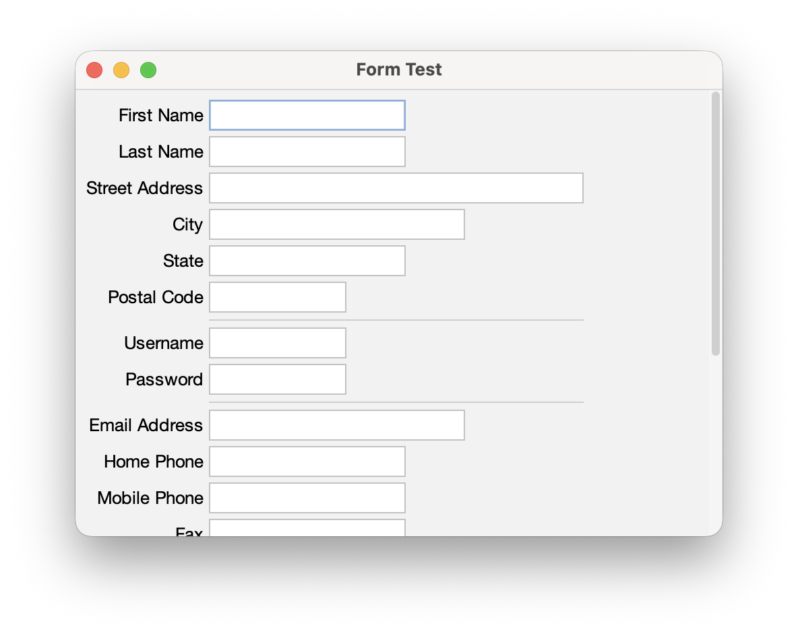

## Button Groups
The "group" attribute associates a button with a button group. For example, the following markup creates two radio buttons belonging to the "orientation" group:

```xml
<radio-button name="leftToRightButton" group="orientation" text="leftToRight"/>
<radio-button name="rightToLeftButton" group="orientation" text="rightToLeft"/>
```

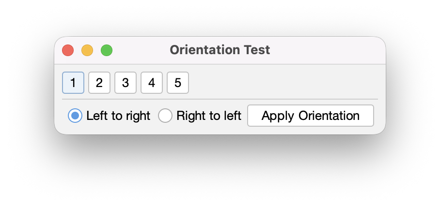

## Tabbed Panes
When used in conjunction with `JTabbedPane`, the "tabTitle" and "tabIcon" attributes can be used to specify a component's tab title and icon, respectively:

```xml
<tabbed-pane name="tabbedPane" tabPlacement="top" tabLayoutPolicy="scroll-tab-layout">
    <label tabTitle="Tab 1" tabIcon="icons/home_24dp.svg; 18"
        text="This is the first tab."
        horizontalAlignment="center"
        verticalAlignment="center"/>
</tabbed-pane>
```

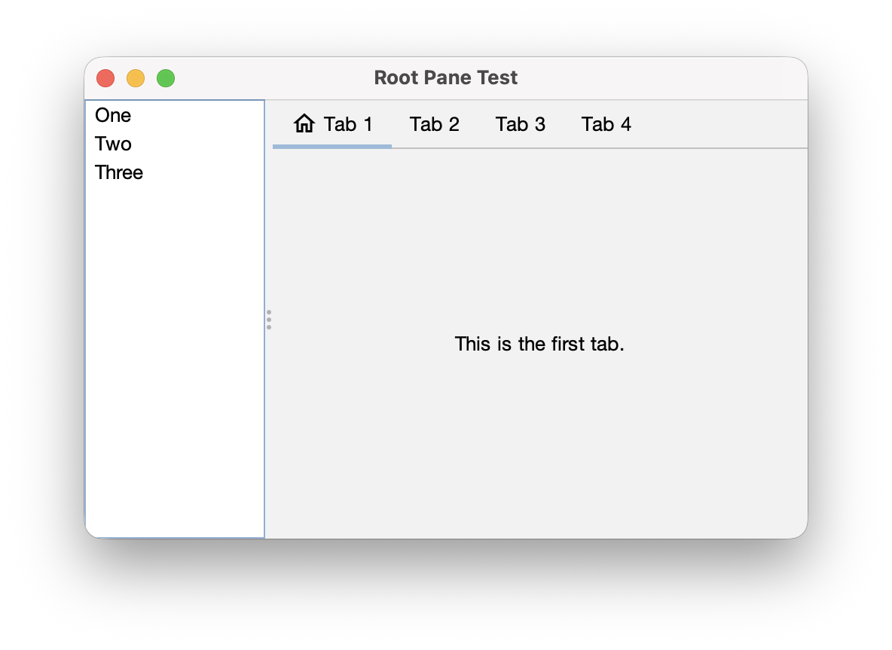

## FlatLaf Styles
FlatLaf style and [style class](https://www.formdev.com/flatlaf/typography/) values can be specified via the "style" and "styleClass" attributes, respectively. For example, this markup applies the "h4" style class to a `JLabel` instance used by a list cell renderer:

```xml
<row-panel spacing="4" padding="4" opaque="true">
    <label name="iconLabel" size="30" verticalAlignment="center"/>

    <column-panel weight="1">
        <label name="nameLabel" styleClass="h4"/>
        <label name="descriptionLabel"/>
    </column-panel>
</row-panel>
```

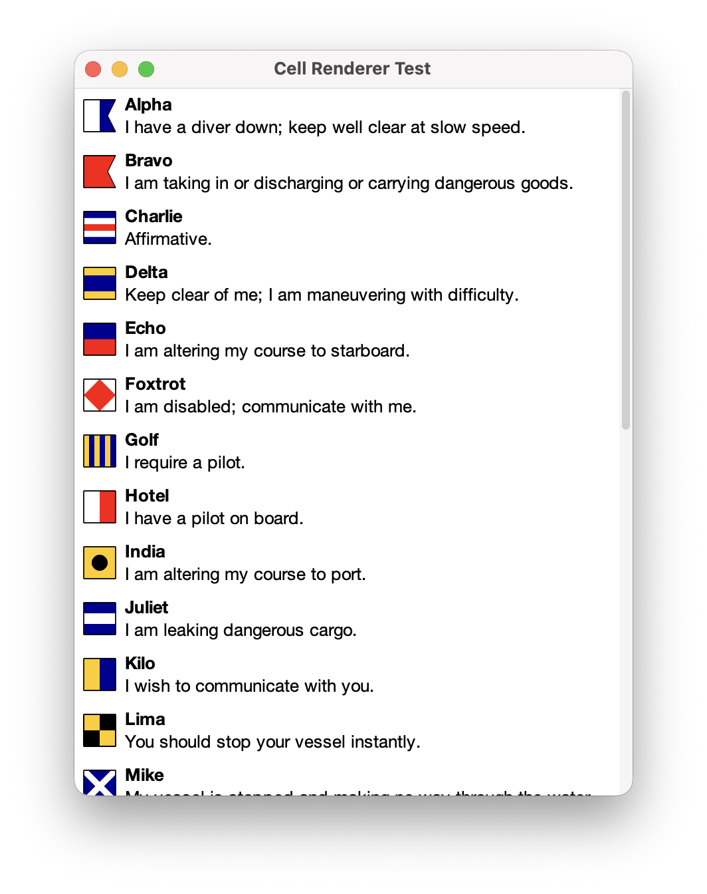

FlatLaf text styles are also accessible via the "font" property:

```xml
<text-pane text="Heading 1" font="h1.font" wrapText="true"/>
```

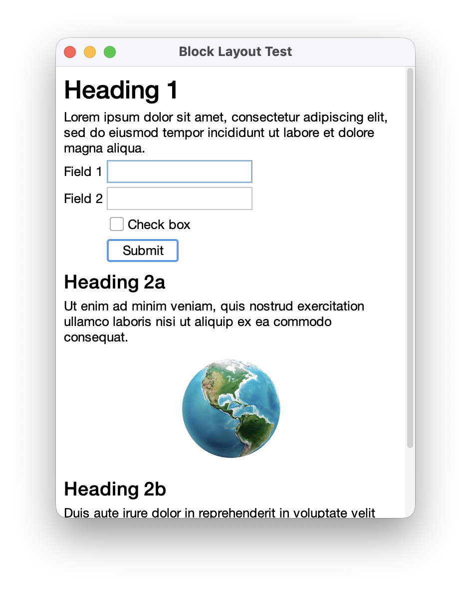

Several FlatLaf text field [properties](https://www.formdev.com/flatlaf/client-properties/#JTextField) are also supported. For example:

```xml
<column-panel spacing="4" padding="8" opaque="true">
    <text-field columns="16"
        placeholderText="firstName"
        showClearButton="true"/>
    
    <text-field columns="16"
        placeholderText="lastName"
        showClearButton="true"/>

    <spacer size="8"/>

    <text-field columns="16"
        leadingIcon="icons/search_24dp.svg; 18"
        trailingIcon="icons/people_24dp.svg; 18"/>
</column-panel>
```

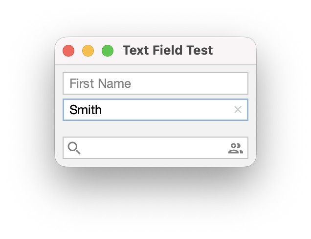

# Utility Components
In addition to the features outlined above, Sierra also includes some common user interface elements not provided by Swing.

## Validated Input
The `NumberField` and `ValidatedTextField` components can be used to validate user input. `NumberField` accepts only numeric content, and `ValidatedTextField` accepts only content that matches a provided regular expression. Similiar to `JFormattedTextField`, the `getValue()` method of these classes can be used to obtain the validated data:

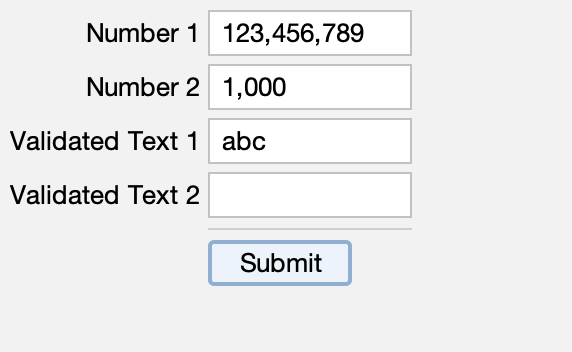

`NumberField` is localized. See [ValidatedInputTest.java](sierra-test/src/main/java/org/httprpc/sierra/test/ValidatedInputTest.java) for more information.

## Date and Time Selection
The `DatePicker` and `TimePicker` components allow a user to select a local date and time, respectively:

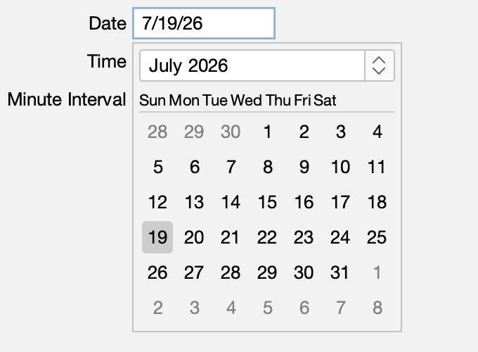
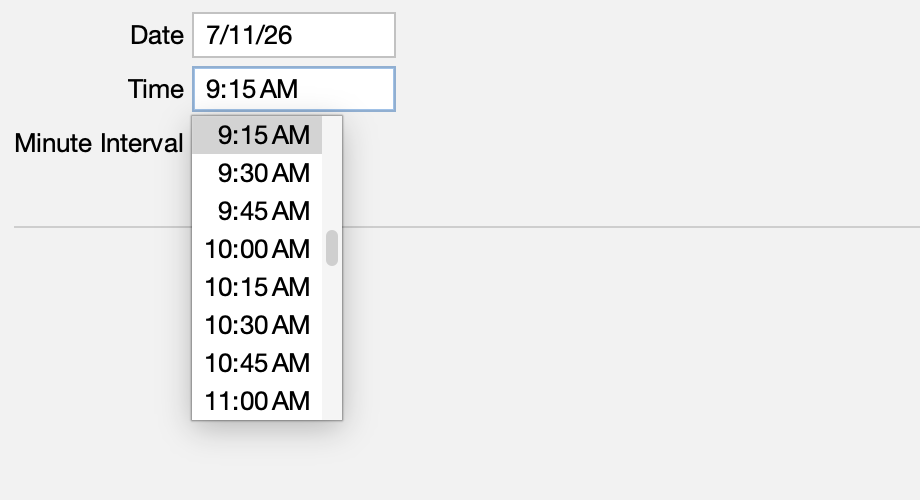

These classes are localized. See [DateTimePickerTest.java](sierra-test/src/main/java/org/httprpc/sierra/test/DateTimePickerTest.java) for more information.

## Suggestion Pickers
The `SuggestionPicker` component allows a user to choose from a list of predefined values: 

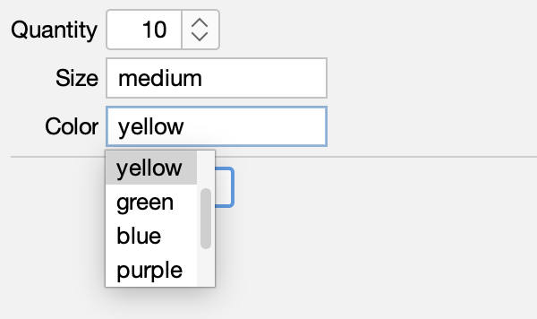

See [SuggestionPickerTest.java](sierra-test/src/main/java/org/httprpc/sierra/test/SuggestionPickerTest.java) for more information.

## Menu Buttons
The `MenuButton` component displays a popup menu when pressed:

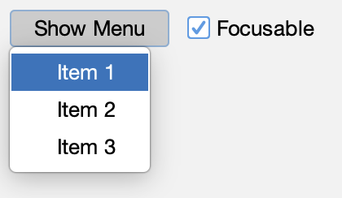

See [MenuButtonTest.java](sierra-test/src/main/java/org/httprpc/sierra/test/MenuButtonTest.java) for more information.

## Activity Indicators
The `ActivityIndicator` component shows indeterminate progress:


See [ActivityIndicatorTest.java](sierra-test/src/main/java/org/httprpc/sierra/test/ActivityIndicatorTest.java) for more information.

## Badges
The `Badge` component displays a small amount of status information:

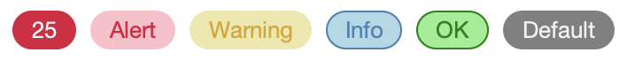

See [BadgeTest.java](sierra-test/src/main/java/org/httprpc/sierra/test/BadgeTest.java) for more information.

## Charts
The `ChartPane` component displays a [chart](charts-reference.md):

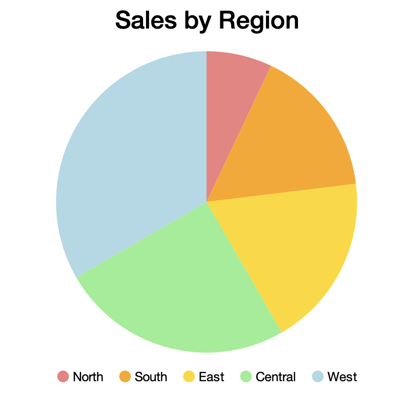

Charts automatically adapt to the current theme:

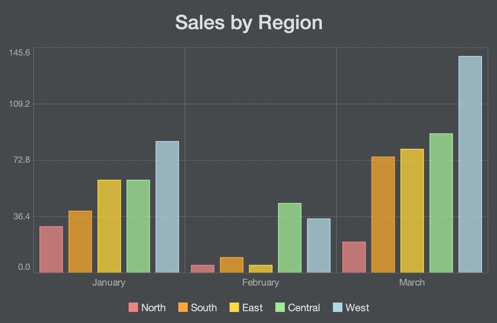
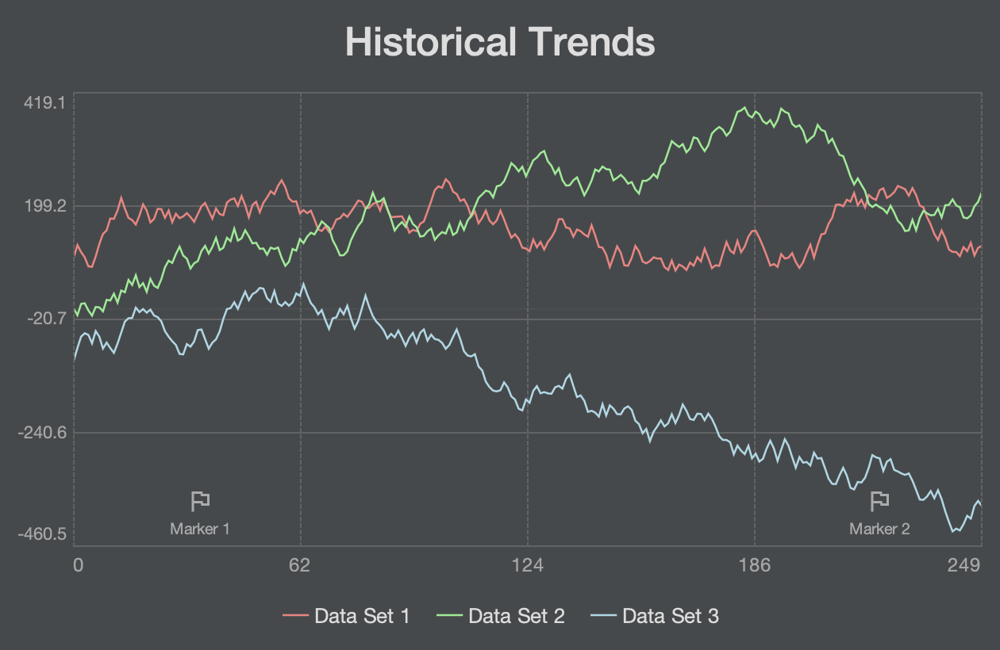

See [ChartsTest.java](sierra-test/src/main/java/org/httprpc/sierra/test/ChartsTest.java) for more information.

# Focus Management
The `ScrollingKeyboardFocusManager` class ensures that components are automatically scrolled into view when focused (something that Swing oddly does not do by default). It can be installed at application startup as follows:

```java
KeyboardFocusManager.setCurrentKeyboardFocusManager(new ScrollingKeyboardFocusManager());
```

See [FormTest.java](sierra-test/src/main/java/org/httprpc/sierra/test/FormTest.java) for more information.

# Task Execution
The `TaskExecutor` class performs a task in the background and and invokes a callback on the UI thread when the task is complete:

```java
public <T> void execute(Callable<T> task, BiConsumer<T, Exception> handler) { ... }
```

For example:

```java
taskExecutor.execute(() -> {    
    // Perform long-running task that may throw
    return result;
}, (result, exception) -> {
    if (exception == null) {
        // Handle success
    } else {
        // Handle failure
    }
});
```

Internally, tasks are submitted to an executor service provided to the `TaskExecutor` constructor. See [TaskExecutorTest.java](sierra-test/src/main/java/org/httprpc/sierra/test/TaskExecutorTest.java) for more information.

# Complete Example
The following is a complete example of an application built using Sierra. It uses the Tiingo [End-of-Day](https://www.tiingo.com/documentation/end-of-day) API to retrieve historical stock pricing information:

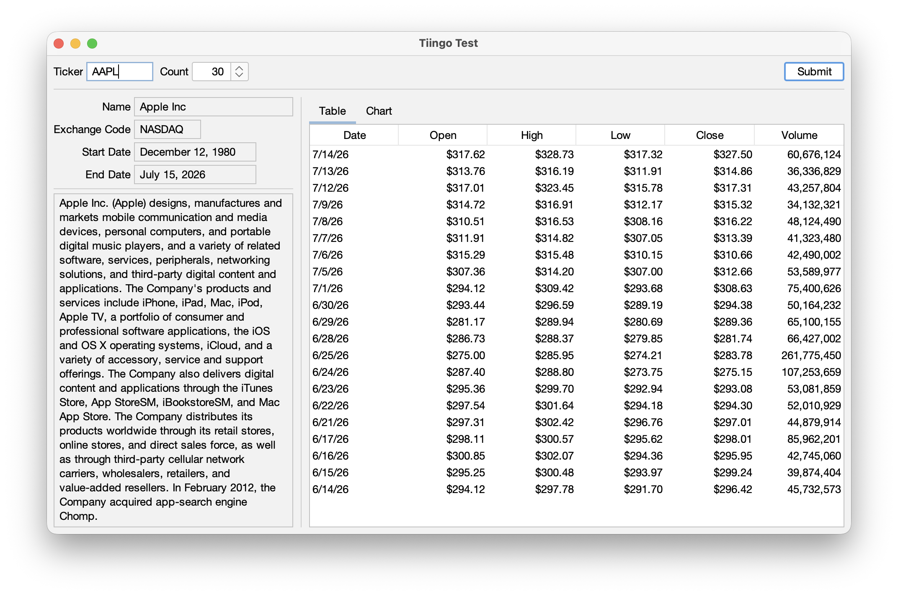
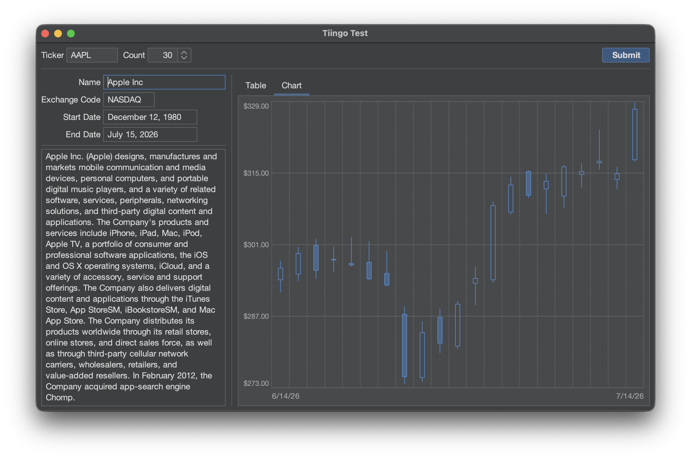

The application consists of the following source files:

* [TiingoTest.java](sierra-test/src/main/java/org/httprpc/sierra/test/TiingoTest.java) - primary application logic
* [TiingoServiceProxy.java](sierra-test/src/main/java/org/httprpc/sierra/test/TiingoServiceProxy.java) - proxy interface used to submit API requests
* [Asset.java](sierra-test/src/main/java/org/httprpc/sierra/test/Asset.java) and [AssetPricing.java](sierra-test/src/main/java/org/httprpc/sierra/test/AssetPricing.java) - data types used by `TiingoServiceProxy`
* [TiingoTest.xml](sierra-test/src/main/resources/org/httprpc/sierra/test/TiingoTest.xml) - UI declaration
* [TiingoTest.properties](sierra-test/src/main/resources/org/httprpc/sierra/test/TiingoTest.properties) - localized string resources

An API token is required and must be specified as a system property at application startup:

```
-Dtoken=<Tiingo API Token>
```

# Sierra Tools
A custom DTD can be generated using the [DTD encoder](sierra-tools/dtd-encoder) tool. An interactive [previewer](sierra-tools/previewer) tool is also available. Both can be downloaded [here](https://github.com/HTTP-RPC/Sierra/releases).
