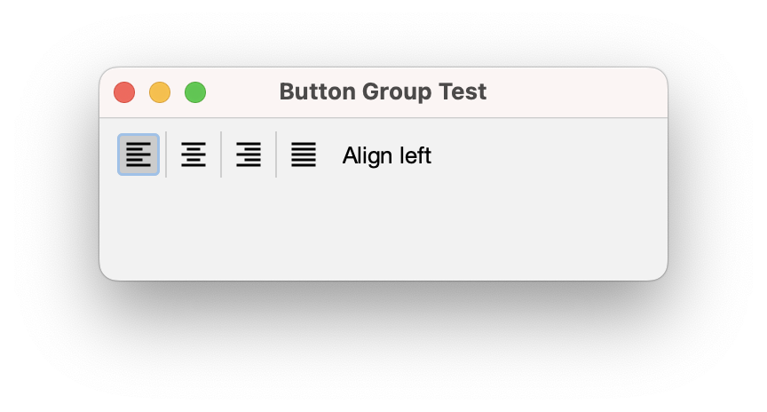
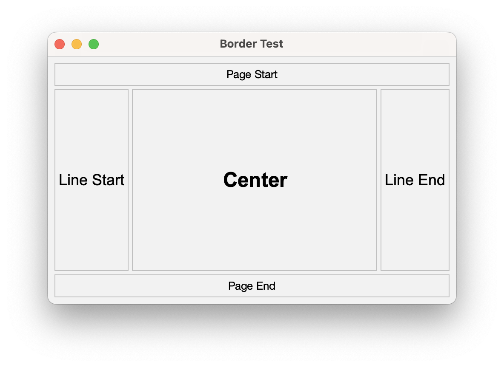
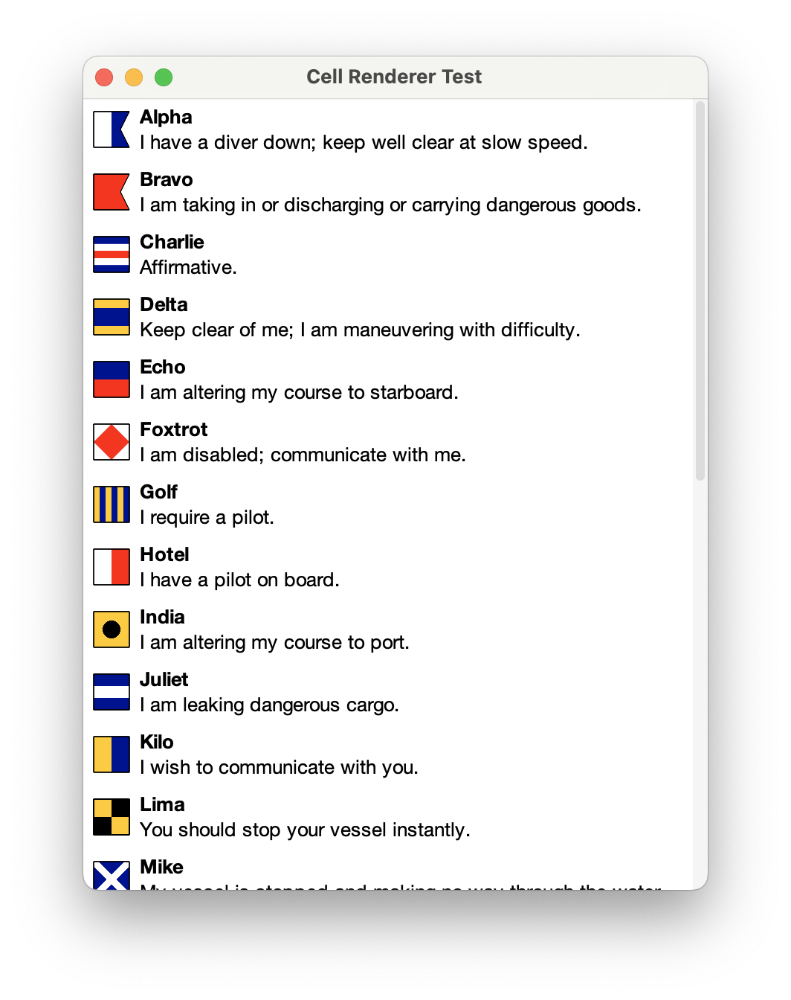
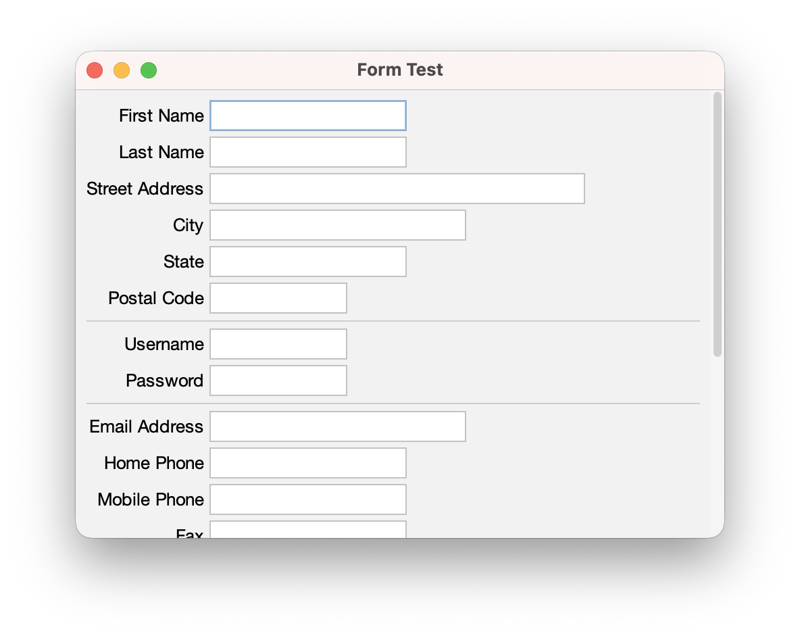

[](https://github.com/HTTP-RPC/Sierra/releases)
[](https://repo1.maven.org/maven2/org/httprpc/sierra/)
[](https://javadoc.io/doc/org.httprpc/sierra)

# Introduction
Sierra is an open-source framework for simplifying development of Java Swing applications. It is extremely lightweight and has no external dependencies. The project's name comes from the nautical _S_ or _Sierra_ flag, representing the first letter in "Swing":


This guide introduces the Sierra framework and provides an overview of its key features.

# Contents
* [Getting Sierra](#getting-sierra)
* [Sierra Classes](#sierra-classes)
* [Additional Information](#additional-information)

# Getting Sierra
Sierra is distributed via Maven Central at [org.httprpc:sierra](https://repo1.maven.org/maven2/org/httprpc/sierra/). Java 17 or later is required.

# Sierra Classes
Sierra provides the `UILoader` class, which can be used in conjunction with the following types to to declaratively establish a hierarchy of user interface elements:

* `RowPanel`, a container that automatically arranges sub-components along the x-axis
* `ColumnPanel`, a container that automatically arranges sub-components along the y-axis
* `StackPanel`, a container that automatically arranges sub-components by z-order
* `Spacer`, a component that provides fixed or flexible space between other components

These types offer an alternative to the standard Java layout managers, which can often be limiting or difficult to use in practice. `RowPanel` optionally aligns sub-components to baseline, similar to `FlowLayout`. `ColumnPanel` optionally aligns sub-components to a grid, similar to an HTML table or `GridBagLayout`. 

Sierra also includes the `TextPane` and `ImagePane` components, which provide an alternative to `JLabel` for displaying basic text or image content, respectively. `TextPane` supports wrapping text without requiring HTML, and `ImagePane` supports scaling without requiring an intermediate `BufferedImage`.

For example, the following markup declares a column panel containing a graphic and a simple greeting:

```xml
<column-panel padding="8" opaque="true" background="#ffffff">
    <image-pane image="world.png" scaleMode="fill-width"/>
    <text-pane text="Hello, World!" horizontalAlignment="center"/>
</column-panel>
```

This markup could be deserialized and set as the content pane of a frame or dialog like this:

```java
setContentPane(UILoader.load(this, "greeting-test.xml"));
```

The resulting output is shown below:


The complete source code for this example can be found [here](https://github.com/HTTP-RPC/Sierra/blob/master/sierra-test/src/main/java/org/httprpc/sierra/test/GreetingTest.java).

## Elements
XML elements represent component instances. Most Swing and all Sierra components are supported by default. Support for custom elements can be added via the `bind()` method of the `UILoader` class.

Elements can be nested to create a component hierarchy. For example:

```xml
<column-panel spacing="8" padding="8">
    <column-panel>
        <check-box text="checkBox1"/>
        <check-box text="checkBox2"/>
    </column-panel>

    <row-panel spacing="8">
        <button name="button" text="executeTask"/>
        <label name="label" foreground="#808080"/>
        <spacer weight="1"/>
        <activity-indicator name="activityIndicator" indicatorSize="18"/>
    </row-panel>
</column-panel>
```


## Attributes
XML attributes generally represent component properties. For example, this markup creates an instance of `TextPane` and sets its "text" property to "Hello, World!":

```xml
<text-pane text="Hello, World!" horizontalAlignment="center"/>
```

Numeric and boolean values are automatically converted to the appropriate type. Properties that expect values defined by the `SwingConstants` class (such as "horizontalAlignment") can be specified via a lowercase/hyphenated version of the constant name. This also applies to the constants defined by Sierra's `HorizontalAlignment`, `VerticalAlignment`, and `ImagePane.ScaleMode` enum types.

### Color and Font Values
Color and font properties can be specified using the formats supported by `Color#decode()` and `Font#decode()`, respectively. For example, this markup creates an instance of `JLabel` and sets its "foreground" property to gray:

```xml
<label name="label" foreground="#808080"/>
```

### Image and Icon Values
Image and icon properties can be specified via a path to an image document on the application's classpath. The path is relative to the document's "owner", the value passed as the first argument to `UILoader#load()`. For example:

```xml
<image-pane image="world.png" scaleMode="fill-width"/>
```

Icon support is currently limited to SVG documents and requires the [FlatLaf Extras](https://github.com/JFormDesigner/FlatLaf/tree/main/flatlaf-extras) library:

```xml
<toggle-button name="alignLeftButton" icon="format_align_left_black_18dp.svg" FlatLaf.style="buttonType: toolBarButton"/>
```



### Border and Padding Values
The "border" and "padding" attributes can be used to specify a component's border and padding, respectively. These attributes mirror the corresponding concepts in the CSS box model. For example, this markup creates an instance of `JLabel` with a light gray line border and four pixels of padding on each side:

```xml
<label text="pageStart" horizontalAlignment="center" border="#c0c0c0" padding="4"/>
```

### Weight and Size Values
The "weight" attribute specifies the amount of excess space in a container that should be allocated to a component, relative to other weighted components. When applied to a `Spacer` instance, it creates a "glue" component that automatically shrinks or stretches depending on the size of its container. However, weights are not limited to spacers and can be applied to any component type:

```xml
<row-panel spacing="4" weight="1">
    <label text="lineStart" horizontalAlignment="center" border="#c0c0c0" padding="4" FlatLaf.styleClass="h2"/>
    <label text="center" horizontalAlignment="center" border="#c0c0c0" padding="4" FlatLaf.styleClass="h00" weight="1"/>
    <label text="lineEnd" horizontalAlignment="center" border="#c0c0c0" padding="4" FlatLaf.styleClass="h2"/>
</row-panel>
```



The "size" attribute specifies a fixed dimension for a component. It is typically used with `Spacer` instances to create "struts" between components, as an alternative to the "spacing" property provided by `RowPanel` and `ColumnPanel`:

```xml
<column-panel spacing="4" padding="8">
    <row-panel>
        <button text="1a"/>
        <spacer size="4"/>
        <button text="1b"/>
        <spacer size="4"/>
        <button text="1c"/>
        <spacer weight="1"/>
    </row-panel>
    
    ...
    
</column-panel>
```


### Client Properties
Any attribute whose name contains a period (".") is considered a "client property" and is applied via `JComponent#putClientProperty()`. For example, this markup applies the "h2" FlatLaf style class to a `JLabel` instance:

```xml
<label name="nameLabel" FlatLaf.styleClass="h4"/>
```



### Element Names
The "name" attribute associates a name with a component. The value is automatically injected into a field with the same name defined by the document's owner (called an "outlet"). 

For example, the following markup defines outlets named "greetingButton" and "greetingLabel": 

```xml
<button name="greetingButton" text="prompt"/>
<label name="greetingLabel" horizontalAlignment="center"/>
```

When the `load()` method returns, the corresponding fields in the owner will be populated with the instances declared in the markup:

```java
public class ActionTest extends JFrame implements Runnable {
    private JButton greetingButton;
    private JLabel greetingLabel;
    
    ...
}
```

### Resource Bundles
If a non-`null` value is passed as the third argument to the `load()` method, values of text properties are considered resource keys and are used to look up the associated value in the provided resource bundle. For example:

```xml
<column-panel spacing="4" alignToGrid="true" padding="8">
    <row-panel alignToBaseline="true">
        <label text="firstName" alignmentX="1.0"/>
        <text-field columns="12" alignmentX="0.0"/>
    </row-panel>

    <row-panel alignToBaseline="true">
        <label text="lastName" alignmentX="1.0"/>
        <text-field columns="12" alignmentX="0.0"/>
    </row-panel>

    <row-panel alignToBaseline="true">
        <label text="streetAddress" alignmentX="1.0"/>
        <text-field columns="24" alignmentX="0.0"/>
    </row-panel>
    
    ...
    
</column-panel>
```

```properties
title = Form Test

firstName = First Name
lastName = Last Name
streetAddress = Street Address

...
```



## Cell Alignment
When grid alignment is enabled in a `ColumnPanel`, the sub-components (or "cells") of every `RowPanel` in the column are vertically aligned in a grid, as in a spreadsheet or HTML table. The width of each sub-column is determined as the maximum preferred width of the cells in that column (i.e. the components having the same index in each row).

Cell contents are aligned based on the component's _x_ and _y_ alignment values (returned by `getAlignmentX()` and `getAlignmentY()`, respectively). For most components, the default is 0.5, indicating that the component should fill the entire cell along both axes. Values between 0.0 and 0.5 will align the component to the cell's leading or top edge, and values between 0.5 and 1.0 will align the component to the cell's trailing or bottom edge. In both cases, a proportional amount of the excess space will be allocated to the component. A value of 0 or 1 will result in no excess space being given to the component (i.e. it will be aligned to the appropriate edge and will be given its preferred size along that axis).

For [example](https://github.com/HTTP-RPC/Sierra/blob/master/sierra-test/src/main/resources/org/httprpc/sierra/test/alignment-test.xml):


## Utility Components
In addition to the features outlined above, Sierra also includes some common user interface elements not provided by Swing.

### Menu Buttons
The `MenuButton` component displays a popup menu when pressed. For example:


See [MenuButtonTest.java](https://github.com/HTTP-RPC/Sierra/blob/master/sierra-test/src/main/java/org/httprpc/sierra/test/MenuButtonTest.java) for more information.

### Date and Time Pickers
The `DatePicker` and `TimePicker` components allow a user to select a local date and time, respectively:


These classes are localized. See [DateTimePickerTest.java](https://github.com/HTTP-RPC/Sierra/blob/master/sierra-test/src/main/java/org/httprpc/sierra/test/DateTimePickerTest.java) for more information.

### Suggestion Pickers
The `SuggestionPicker` component allows a user to choose from a list of predefined values: 


See [SuggestionPickerTest.java](https://github.com/HTTP-RPC/Sierra/blob/master/sierra-test/src/main/java/org/httprpc/sierra/test/SuggestionPickerTest.java) for more information.

### Activity Indicators
The `ActivityIndicator` component shows indeterminate progress:


See [ActivityIndicatorTest.java](https://github.com/HTTP-RPC/Sierra/blob/master/sierra-test/src/main/java/org/httprpc/sierra/test/ActivityIndicatorTest.java) for more information.

## Focus Management
The `ScrollingKeyboardFocusManager` class ensures that components are automatically scrolled into view when focused (something that Swing oddly does not do by default). It can be installed at application startup as follows:

```java
KeyboardFocusManager.setCurrentKeyboardFocusManager(new ScrollingKeyboardFocusManager());
```

See [FormTest.java](https://github.com/HTTP-RPC/Sierra/blob/master/sierra-test/src/main/java/org/httprpc/sierra/test/FormTest.java) for more information.

## Task Execution
The `TaskExecutor` class performs a task in the background and and invokes a callback on the UI thread when the task is complete:

```java
public <T> void execute(Callable<T> callable, BiConsumer<T, Exception> consumer) { ... }
```

For example:

```java
taskExecutor.execute(() -> {    
    // Perform long-running task that may throw
    return result;
}, (result, exception) -> {
    if (exception == null) {
        // Handle success
    } else {
        // Handle failure
    }
});
```

Internally, tasks are submitted to an executor service provided to the `TaskExecutor` constructor. See [TaskExecutorTest.java](https://github.com/HTTP-RPC/Sierra/blob/master/sierra-test/src/main/java/org/httprpc/sierra/test/TaskExecutorTest.java) for more information.

# Additional Information
This guide introduced the Sierra framework and provided an overview of its key features. For additional information, see the [source code](https://github.com/HTTP-RPC/Sierra/tree/master/sierra/src/main/java/org/httprpc/sierra).
