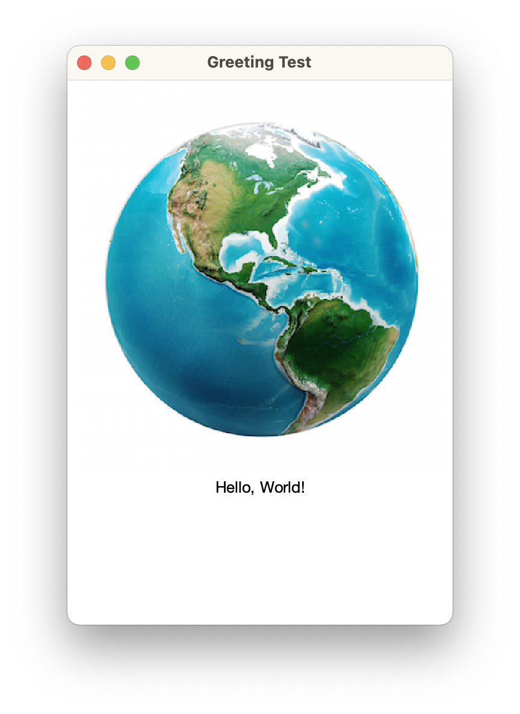
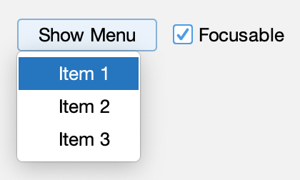
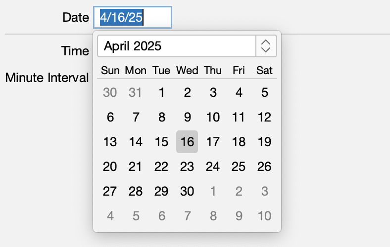
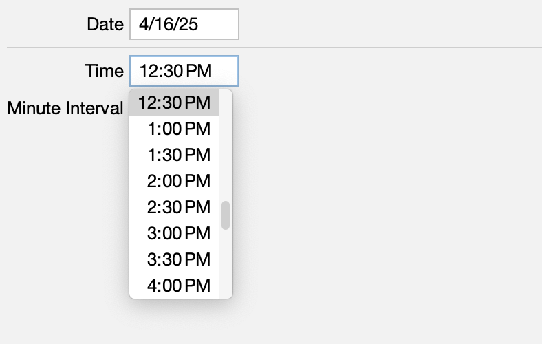
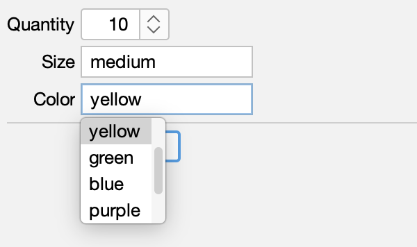

[](https://github.com/HTTP-RPC/Sierra/releases)
[](https://repo1.maven.org/maven2/org/httprpc/sierra/)
[](https://javadoc.io/doc/org.httprpc/sierra)

# Introduction
Sierra is an open-source framework for simplifying development of Java Swing applications. It is extremely lightweight and has no external dependencies. The project's name comes from the nautical _S_ or _Sierra_ flag, representing the first letter in "Swing":


This guide introduces the Sierra framework and provides an overview of its key features.

# Contents
* [Getting Sierra](#getting-sierra)
* [Sierra Classes](#sierra-classes)
* [Examples](#examples)
* [Additional Information](#additional-information)

# Getting Sierra
Sierra is distributed via Maven Central at [org.httprpc:sierra](https://repo1.maven.org/maven2/org/httprpc/sierra/). Java 17 or later is required.

# Sierra Classes
Sierra provides the the following components:

* `RowPanel`, a container that automatically arranges sub-components along the x-axis
* `ColumnPanel`, a container that automatically arranges sub-components along the y-axis
* `StackPanel`, a container that automatically arranges sub-components by z-order

These components offer an alternative to the standard Java layout managers, which can often be limiting or difficult to use in practice. `RowPanel` optionally aligns sub-components to baseline, similar to `FlowLayout`. `ColumnPanel` optionally aligns sub-components to a grid, similar to an HTML table or `GridBagLayout`. 

Sierra also includes the `TextPane` and `ImagePane` components, which provide an alternative to `JLabel` for displaying basic text or image content, respectively. `TextPane` supports wrapping text without requiring HTML, and `ImagePane` supports scaling without requiring an intermediate `BufferedImage`.

For example, the following code declares a column panel containing a graphic and a simple greeting:

```xml
TODO
```

The resulting output is shown below:



The complete source code for this example can be found [here](https://github.com/HTTP-RPC/Sierra/blob/master/sierra-test/src/main/java/org/httprpc/sierra/test/GreetingTest.java).

### Cell Alignment
When grid alignment is enabled in a `ColumnPanel`, the sub-components (or "cells") of every `RowPanel` in the column are vertically aligned in a grid, as in a spreadsheet or HTML table. The width of each sub-column is determined as the maximum preferred width of the cells in that column (i.e. the components having the same index in each row).

Cell contents are aligned based on the component's _x_ and _y_ alignment values (returned by `getAlignmentX()` and `getAlignmentY()`, respectively). For most components, the default is 0.5, indicating that the component should fill the entire cell along both axes. Values between 0.0 and 0.5 will align the component to the cell's leading or top edge, and values between 0.5 and 1.0 will align the component to the cell's trailing or bottom edge. In both cases, a proportional amount of the excess space will be allocated to the component. A value of 0 or 1 will result in no excess space being given to the component (i.e. it will be aligned to the appropriate edge and will be given its preferred size along that axis).

TODO Examples

[GridTest.java](https://github.com/HTTP-RPC/Sierra/blob/master/sierra-test/src/main/java/org/httprpc/sierra/test/GridTest.java)


[AlignmentTest.java](https://github.com/HTTP-RPC/Sierra/blob/master/sierra-test/src/main/java/org/httprpc/sierra/test/AlignmentTest.java)


## Utility Components
In addition to the features outlined above, Sierra also includes some common user interface elements not provided by Swing.

### Menu Buttons
The `MenuButton` component displays a popup menu when pressed. For example:



See [MenuButtonTest.java](https://github.com/HTTP-RPC/Sierra/blob/master/sierra-test/src/main/java/org/httprpc/sierra/test/MenuButtonTest.java) for more information.

### Date and Time Pickers
The `DatePicker` and `TimePicker` components allow a user to select a local date and time, respectively:




These classes are localized. See [DateTimePickerTest.java](https://github.com/HTTP-RPC/Sierra/blob/master/sierra-test/src/main/java/org/httprpc/sierra/test/DateTimePickerTest.java) for more information.

### Suggestion Pickers
The `SuggestionPicker` component allows a user to choose from a list of predefined values: 



See [SuggestionPickerTest.java](https://github.com/HTTP-RPC/Sierra/blob/master/sierra-test/src/main/java/org/httprpc/sierra/test/SuggestionPickerTest.java) for more information.

### Activity Indicators
The `ActivityIndicator` component shows indeterminate progress:


See [ActivityIndicatorTest.java](https://github.com/HTTP-RPC/Sierra/blob/master/sierra-test/src/main/java/org/httprpc/sierra/test/ActivityIndicatorTest.java) for more information.

## Focus Management
The `ScrollingKeyboardFocusManager` class ensures that components are automatically scrolled into view when focused (something that Swing oddly does not do by default). It can be installed at application startup as follows:

```java
KeyboardFocusManager.setCurrentKeyboardFocusManager(new ScrollingKeyboardFocusManager());
```

See [FormTest.java](https://github.com/HTTP-RPC/Sierra/blob/master/sierra-test/src/main/java/org/httprpc/sierra/test/FormTest.java) for more information.

## Task Execution
The `TaskExecutor` class performs a task in the background and and invokes a callback on the UI thread when the task is complete:

```java
public <T> void execute(Callable<T> callable, BiConsumer<T, Exception> consumer) { ... }
```

For example:

```java
taskExecutor.execute(() -> {    
    // Perform long-running task that may throw
    return result;
}, (result, exception) -> {
    if (exception == null) {
        // Handle success
    } else {
        // Handle failure
    }
});
```

Internally, tasks are submitted to an executor service provided to the `TaskExecutor` constructor. See [TaskExecutorTest.java](https://github.com/HTTP-RPC/Sierra/blob/master/sierra-test/src/main/java/org/httprpc/sierra/test/TaskExecutorTest.java) for more information.

# Examples
This section includes examples demonstrating usage of `UILoader` with the [Flat](https://github.com/JFormDesigner/FlatLaf) look-and-feel.

## Border Layout
Inspired by the [border layout](https://docs.oracle.com/javase/tutorial/uiswing/layout/border.html) tutorial example.

[BorderTest.java](https://github.com/HTTP-RPC/Sierra/blob/master/sierra-test/src/main/java/org/httprpc/sierra/test/BorderTest.java)


## Component Orientation
Inspired by the [flow layout](https://docs.oracle.com/javase/tutorial/uiswing/layout/flow.html) tutorial example.

[OrientationTest.java](https://github.com/HTTP-RPC/Sierra/blob/master/sierra-test/src/main/java/org/httprpc/sierra/test/OrientationTest.java)


## Flow Alignment
Demonstrates flow alignment.

[FlowTest.java](https://github.com/HTTP-RPC/Sierra/blob/master/sierra-test/src/main/java/org/httprpc/sierra/test/FlowTest.java)


## Box Alignment
Demonstrates box alignment.

[BoxTest.java](https://github.com/HTTP-RPC/Sierra/blob/master/sierra-test/src/main/java/org/httprpc/sierra/test/BoxTest.java)


## Baseline Alignment
Demonstrates baseline alignment.

[BaselineTest.java](https://github.com/HTTP-RPC/Sierra/blob/master/sierra-test/src/main/java/org/httprpc/sierra/test/BaselineTest.java)


## Action Handling
Demonstrates associating an action handler with a button.

[ActionTest.java](https://github.com/HTTP-RPC/Sierra/blob/master/sierra-test/src/main/java/org/httprpc/sierra/test/ActionTest.java)


## Button Group
Demonstrates a button group.

[ButtonGroupTest.java](https://github.com/HTTP-RPC/Sierra/blob/master/sierra-test/src/main/java/org/httprpc/sierra/test/ButtonGroupTest.java)


## Cell Renderer
Demonstrates a custom cell renderer.

[CellRendererTest.java](https://github.com/HTTP-RPC/Sierra/blob/master/sierra-test/src/main/java/org/httprpc/sierra/test/CellRendererTest.java)


# Additional Information
This guide introduced the Sierra framework and provided an overview of its key features. For additional information, see the [source code](https://github.com/HTTP-RPC/Sierra/tree/master/sierra/src/main/java/org/httprpc/sierra).
