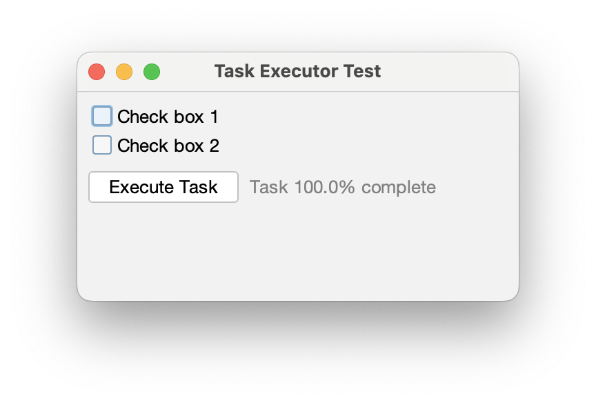
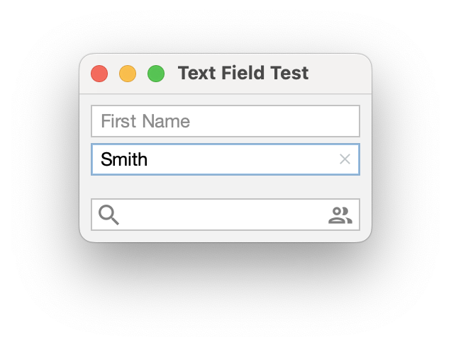
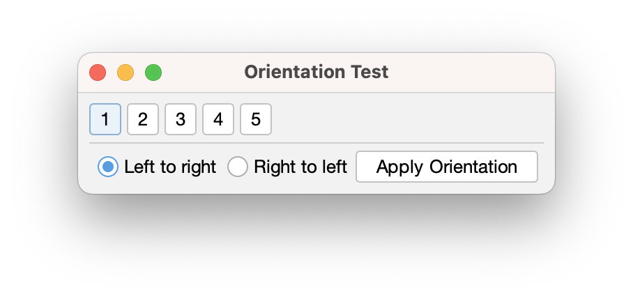
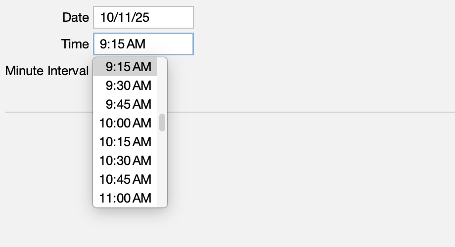

[](https://github.com/HTTP-RPC/Sierra/releases)
[](https://central.sonatype.com/artifact/org.httprpc/sierra/versions)
[](https://javadoc.io/doc/org.httprpc/sierra)

# Introduction
Sierra is an open-source framework for simplifying development of Java Swing applications. It is extremely lightweight and has minimal external dependencies. The project's name comes from the nautical _S_ or _Sierra_ flag, representing the first letter in "Swing":


This guide introduces the Sierra framework and provides an overview of its key features.

# Getting Sierra
Sierra is distributed via Maven Central at [org.httprpc:sierra](https://central.sonatype.com/artifact/org.httprpc/sierra/versions). Java 21 or later is required. [FlatLaf](https://www.formdev.com/flatlaf/) is recommended.

A [DTD](sierra.dtd) is provided to assist with editing. It is not used for validation and is not required.

# Sierra Classes
Sierra provides the `UILoader` class, which can be used in conjunction with the following types to to declaratively establish a hierarchy of user interface elements:

* `RowPanel` - arranges sub-components in a horizontal line, optionally aligning to baseline
* `ColumnPanel` - arranges sub-components in a vertical line, optionally aligning nested elements to a grid
* `StackPanel` - sizes sub-components to fill the available space
* `Spacer` - provides fixed or flexible space between other components

These classes offer an alternative to the standard Java layout managers, which can often be limiting or difficult to use in practice.

Sierra also includes the `TextPane` and `ImagePane` components, which provide an alternative to `JLabel` for displaying basic text or image content, respectively. `TextPane` supports wrapping without requiring HTML, and `ImagePane` supports scaling without requiring an intermediate `BufferedImage`.

For example, the following markup declares a column panel containing a graphic and a simple greeting:

```xml
<?xml version="1.0" encoding="UTF-8"?>

<!DOCTYPE column-panel SYSTEM "sierra.dtd">

<column-panel padding="8" opaque="true" background="white">
    <image-pane image="world.png" scaleMode="fill-width"/>
    <text-pane text="Hello, World!" horizontalAlignment="center"/>
</column-panel>
```

This markup could be deserialized and set as the content pane of a frame or dialog as follows:

```java
setContentPane(UILoader.load(this, "greeting-test.xml"));
```


The complete source code for this example can be found [here](sierra-test/src/main/java/org/httprpc/sierra/test/GreetingTest.java).

## Elements
XML elements represent component instances. Most Swing and all Sierra components are supported by default. Support for additional elements can be added via the `bind()` method of the `UILoader` class.

Elements can be nested to create a component hierarchy. For example:

```xml
<column-panel spacing="8" padding="8">
    <column-panel>
        <check-box text="checkBox1"/>
        <check-box text="checkBox2"/>
    </column-panel>

    <row-panel spacing="8">
        <button name="button" text="executeTask"/>
        <label name="label" foreground="gray"/>
        <spacer weight="1"/>
        <activity-indicator name="activityIndicator" indicatorSize="18"/>
    </row-panel>
</column-panel>
```



## Attributes
XML attributes generally represent component properties. For example, this markup creates an instance of `TextPane` and sets its "text" property to "Hello, World!":

```xml
<text-pane text="Hello, World!" horizontalAlignment="center"/>
```

Numeric and boolean values are specified via their string representations. Supported constants and enum values are specified in [kebab case](https://en.wikipedia.org/wiki/Letter_case#Kebab_case).

### Color and Font Values
Color and font properties can be specified using the formats supported by `Color#decode()` and `Font#decode()`, respectively. For example, this markup creates an instance of `JLabel` and sets its "foreground" property to gray:

```xml
<label name="label" foreground="#808080"/>
```

Colors and fonts can also be specified by name. The name can refer to either a value provided by Swing's UI defaults or a value defined by `UILoader`:

```xml
<label name="label" foreground="gray"/>
```

Sierra supports the 16 [basic web colors](https://en.wikipedia.org/wiki/Web_colors#Basic_colors) by default. Additional named colors and fonts can be added via the `define()` methods of the `UILoader` class.

### Image and Icon Values
Image and icon properties can be specified via a path to an image document on the application's classpath. The path is relative to the document's "owner", the value passed as the first argument to `UILoader#load()`. For example:

```xml
<image-pane image="world.png" scaleMode="fill-width"/>
```

Icon support is currently limited to SVG documents and requires the [FlatLaf Extras](https://github.com/JFormDesigner/FlatLaf/tree/main/flatlaf-extras) library:

```xml
<toggle-button name="alignLeftButton"
    icon="format_align_left_black_18dp.svg"
    style="buttonType: toolBarButton"
    group="alignment"/>
```


### Border and Padding Values
The "border" and "padding" attributes can be used to create a solid border and reserve space around a component, respectively. For example, this markup creates a label with a light gray border and four pixels of padding on each side:

```xml
<label text="pageStart" horizontalAlignment="center" border="silver" padding="4"/>
```

Border thickness can be specified as shown below:

```xml
border="#00ff00, 4"
```

Padding values for multiple sides can be specified in _top_, _left_, _bottom_, _right_ order:

```xml
padding="8, 8, 8, 8"
```

### Weight and Size Values
The "weight" attribute specifies the amount of excess space in a container that should be allocated to a component, relative to other weighted components in the container. When applied to a `Spacer` instance, it creates a "glue" component that automatically shrinks or stretches depending on the size of its container. However, weights are not limited to spacers and can be applied to any component type:

```xml
<row-panel spacing="4" weight="1">
    <label text="lineStart" font="h2" horizontalAlignment="center" border="silver" padding="4"/>
    <label text="center" font="h1" horizontalAlignment="center" border="silver" padding="4" weight="1"/>
    <label text="lineEnd" font="h2" horizontalAlignment="center" border="silver" padding="4"/>
</row-panel>
```


The "size" attribute specifies a fixed dimension for a component. It is typically used with `Spacer` instances to create "struts" between components, as an alternative to the "spacing" property provided by `RowPanel` and `ColumnPanel`:

```xml
<column-panel spacing="4" padding="8">
    <row-panel>
        <button text="1a"/>
        <spacer size="4"/>
        <button text="1b"/>
        <spacer size="4"/>
        <button text="1c"/>
        <spacer weight="1"/>
    </row-panel>
    
    ...
    
</column-panel>
```


Size values for multiple dimensions can be specified in _width_, _height_ order:

```xml
size="20, 20"
```

### FlatLaf Client Properties
FlatLaf style and [style class](https://www.formdev.com/flatlaf/typography/) values can be specified via the "style" and "styleClass" attributes, respectively. For example, this markup applies the "h4" style class to a `JLabel` instance used by a list cell renderer:

```xml
<row-panel spacing="4" padding="4" opaque="true">
    <image-pane name="imagePane" size="30, 30" scaleMode="fill-width"/>

    <column-panel>
        <label name="nameLabel" styleClass="h4"/>
        <label name="descriptionLabel"/>
    </column-panel>
</row-panel>
```


FlatLaf text styles are also accessible via the "font" property:

```xml
<text-pane text="Heading 1" font="h1.font" wrapText="true"/>
```


Several FlatLaf text field [properties](https://www.formdev.com/flatlaf/client-properties/#JTextField) are also supported. For example: 

```xml
<column-panel spacing="4" padding="8">
    <text-field columns="16" placeholderText="firstName" showClearButton="true"/>
    <text-field columns="16" placeholderText="lastName" showClearButton="true"/>

    <spacer size="8"/>

    <text-field columns="16" leadingIcon="search_18dp.svg" trailingIcon="people_18dp.svg"/>
</column-panel>
```



### Button Groups
The "group" attribute associates a button with a button group. For example, the following markup creates two radio buttons belonging to the "orientation" group:

```xml
<radio-button name="leftToRightButton" group="orientation" text="leftToRight"/>
<radio-button name="rightToLeftButton" group="orientation" text="rightToLeft"/>
```



### Element Names
The "name" attribute associates an identifier with a component. The value is automatically injected into a field with the same name defined by the document's owner (called an "outlet"). 

For example, the following markup declares outlets named "greetingButton" and "greetingLabel": 

```xml
<button name="greetingButton" text="prompt"/>
<label name="greetingLabel" horizontalAlignment="center"/>
```

When the `load()` method returns, the corresponding fields in the owner will be populated with the instances declared in the markup:

```java
public class ActionTest extends JFrame implements Runnable {
    private JButton greetingButton = null;
    private JLabel greetingLabel = null;
    
    ...

    @Override
    public void run() {
        setContentPane(UILoader.load(this, "action-test.xml", resourceBundle));

        ...
    }
}
```


See [ActionTest.java](sierra-test/src/main/java/org/httprpc/sierra/test/ActionTest.java) for more information.

### Resource Bundles
An optional resource bundle may be provided as the third argument to the `load()` method. When specified, values of text properties are considered resource keys and are used to look up the associated strings in the bundle. For example:

```xml
<column-panel spacing="4" alignToGrid="true" padding="8" scrollableTracksViewportWidth="true">
    <row-panel alignToBaseline="true">
        <label text="firstName" alignmentX="1.0"/>
        <text-field columns="12" alignmentX="0.0"/>
    </row-panel>

    <row-panel alignToBaseline="true">
        <label text="lastName" alignmentX="1.0"/>
        <text-field columns="12" alignmentX="0.0"/>
    </row-panel>

    <row-panel alignToBaseline="true">
        <label text="streetAddress" alignmentX="1.0"/>
        <text-field columns="24" alignmentX="0.0"/>
    </row-panel>
    
    ...
    
</column-panel>
```

```properties
title = Form Test

firstName = First Name
lastName = Last Name
streetAddress = Street Address

...
```

```java
public class FormTest extends JFrame implements Runnable {
    ...

    private static final ResourceBundle resourceBundle = ResourceBundle.getBundle(FormTest.class.getName());

    ...

    @Override
    public void run() {
        var scrollPane = new JScrollPane(UILoader.load(this, "form-test.xml", resourceBundle));

        ...
    }
}
```


See [FormTest.java](sierra-test/src/main/java/org/httprpc/sierra/test/FormTest.java) for more information.

## Cell Alignment
When grid alignment is enabled in a `ColumnPanel`, the sub-components of every `RowPanel` in the column are vertically aligned in a grid, as in a spreadsheet or HTML table. The width of each sub-column is the maximum preferred width of the "cells" in that column (i.e. the components having the same index in each row).

Cell contents are aligned based on the component's _x_ and _y_ alignment values (returned by `getAlignmentX()` and `getAlignmentY()`, respectively). For most components, the default is 0.5, indicating that the component should fill the entire cell along both axes. Values between 0.0 and 0.5 will align the component to the cell's leading or top edge, and values between 0.5 and 1.0 will align the component to the cell's trailing or bottom edge. In both cases, a proportional amount of the excess space will be allocated to the component. A value of 0 or 1 will result in no excess space being given to the component (i.e. it will be aligned to the appropriate edge and will be given its preferred size along that axis).

For example, the following markup demonstrates x-alignment:

```xml
<column-panel spacing="4" alignToGrid="true" padding="8">
    <row-panel>
        <text-pane text="0.0" alignmentX="0.0" border="silver"/>
        <text-pane text="0.25" horizontalAlignment="center" alignmentX="0.25" border="silver"/>
        <text-pane text="0.5" horizontalAlignment="center" alignmentX="0.5" border="silver"/>
        <text-pane text="0.75" horizontalAlignment="center" alignmentX="0.75" border="silver"/>
        <text-pane text="1.0" alignmentX="1.0" border="silver"/>
    </row-panel>

    <row-panel>
        <spacer size="120, 40" border="silver"/>
        <spacer size="120, 40" border="silver"/>
        <spacer size="120, 40" border="silver"/>
        <spacer size="120, 40" border="silver"/>
        <spacer size="120, 40" border="silver"/>
    </row-panel>
</column-panel>
```


This markup demonstrates y-alignment:

```xml
<column-panel spacing="4" alignToGrid="true" padding="8">
    <row-panel>
        <text-pane text="0.0" alignmentY="0.0" border="silver"/>
        <spacer size="160, 80" border="silver"/>
    </row-panel>
    <row-panel>
        <text-pane text="0.25" verticalAlignment="center" alignmentY="0.25" border="silver"/>
        <spacer size="160, 80" border="silver"/>
    </row-panel>
    <row-panel>
        <text-pane text="0.5" verticalAlignment="center" alignmentY="0.5" border="silver"/>
        <spacer size="160, 80" border="silver"/>
    </row-panel>
    <row-panel>
        <text-pane text="0.75" verticalAlignment="center" alignmentY="0.75" border="silver"/>
        <spacer size="160, 80" border="silver"/>
    </row-panel>
    <row-panel>
        <text-pane text="1.0" alignmentY="1.0" border="silver"/>
        <spacer size="160, 80" border="silver"/>
    </row-panel>
</column-panel>
```


Row spacing and cell weights are ignored when grid alignment is enabled.

## Utility Components
In addition to the features outlined above, Sierra also includes some common user interface elements not provided by Swing.

### Validated Input
The `NumberField` and `ValidatedTextField` components can be used to validate user input. `NumberField` accepts only numeric content, and `ValidatedTextField` accepts only content that matches a provided regular expression. Similiar to `JFormattedTextField`, the `getValue()` method of these classes can be used to obtain the validated data.

See [ValidatedInputTest.java](sierra-test/src/main/java/org/httprpc/sierra/test/ValidatedInputTest.java) for more information.

### Date and Time Pickers
The `DatePicker` and `TimePicker` components allow a user to select a local date and time, respectively:




These classes are localized. See [DateTimePickerTest.java](sierra-test/src/main/java/org/httprpc/sierra/test/DateTimePickerTest.java) for more information.

### Suggestion Pickers
The `SuggestionPicker` component allows a user to choose from a list of predefined values: 


See [SuggestionPickerTest.java](sierra-test/src/main/java/org/httprpc/sierra/test/SuggestionPickerTest.java) for more information.

### Menu Buttons
The `MenuButton` component displays a popup menu when pressed:


See [MenuButtonTest.java](sierra-test/src/main/java/org/httprpc/sierra/test/MenuButtonTest.java) for more information.

### Activity Indicators
The `ActivityIndicator` component shows indeterminate progress:


See [ActivityIndicatorTest.java](sierra-test/src/main/java/org/httprpc/sierra/test/ActivityIndicatorTest.java) for more information.

## Focus Management
The `ScrollingKeyboardFocusManager` class ensures that components are automatically scrolled into view when focused (something that Swing oddly does not do by default). It can be installed at application startup as follows:

```java
KeyboardFocusManager.setCurrentKeyboardFocusManager(new ScrollingKeyboardFocusManager());
```

See [FormTest.java](sierra-test/src/main/java/org/httprpc/sierra/test/FormTest.java) for more information.

## Task Execution
The `TaskExecutor` class performs a task in the background and and invokes a callback on the UI thread when the task is complete:

```java
public <T> void execute(Callable<T> task, BiConsumer<T, Exception> handler) { ... }
```

For example:

```java
taskExecutor.execute(() -> {    
    // Perform long-running task that may throw
    return result;
}, (result, exception) -> {
    if (exception == null) {
        // Handle success
    } else {
        // Handle failure
    }
});
```

Internally, tasks are submitted to an executor service provided to the `TaskExecutor` constructor. See [TaskExecutorTest.java](sierra-test/src/main/java/org/httprpc/sierra/test/TaskExecutorTest.java) for more information.

# Complete Example
The following is a complete example of an application built using Sierra. It uses the Tiingo [End-of-Day](https://www.tiingo.com/documentation/end-of-day) API to retrieve historical stock pricing information:


The application consists of the following source files:

* [TiingoTest.java](sierra-test/src/main/java/org/httprpc/sierra/test/TiingoTest.java) - primary application logic
* [TiingoServiceProxy.java](sierra-test/src/main/java/org/httprpc/sierra/test/TiingoServiceProxy.java) - proxy interface used to submit API requests
* [Asset.java](sierra-test/src/main/java/org/httprpc/sierra/test/Asset.java) and [AssetPricing.java](sierra-test/src/main/java/org/httprpc/sierra/test/AssetPricing.java) - data types used by `TiingoServiceProxy`
* [tiingo-test.xml](sierra-test/src/main/resources/org/httprpc/sierra/test/tiingo-test.xml) - UI declaration
* [TiingoTest.properties](sierra-test/src/main/resources/org/httprpc/sierra/test/TiingoTest.properties) - localized string resources

An API token is required and must be specified as a system property at application startup:

```
-Dtoken=<Tiingo API Token>
```
