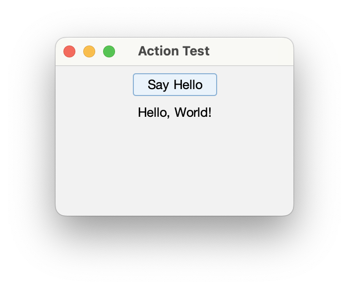

[](https://github.com/HTTP-RPC/Sierra/releases)
[](https://repo1.maven.org/maven2/org/httprpc/sierra/)
[](https://javadoc.io/doc/org.httprpc/sierra)

# Introduction
Sierra is an open-source framework for simplifying development of Java Swing applications. It provides a convenient DSL for declaratively constructing Swing component hierarchies. The framework is extremely lightweight (less than 35KB) and has no external dependencies. 

The project's name comes from the nautical _S_ or _Sierra_ flag, representing the first letter in "Swing":


This guide introduces the Sierra framework and provides an overview of its key features.

# Contents
* [Getting Sierra](#getting-sierra)
* [Sierra Classes](#sierra-classes)
* [Examples](#examples)
* [Additional Information](#additional-information)

# Getting Sierra
Sierra is distributed via Maven Central at [org.httprpc:sierra](https://repo1.maven.org/maven2/org/httprpc/sierra/). Java 11 or later is required.

# Sierra Classes
Sierra provides the `UIBuilder` class, whose methods can be used to declaratively establish a hierarchy of user interface elements. The methods defined by this class form a DSL, or "domain-specific language", that makes it easy to visualize the resulting output:

* `row()` - produces an instance of `RowPanel`, a container that automatically arranges sub-components along the x-axis
* `column()` - produces an instance of `ColumnPanel`, a container that automatically arranges sub-components along the y-axis
* `stack()` - produces an instance of `StackPanel`, a container that automatically arranges sub-components by z-order

These components offer an alternative to the standard Java layout managers, which can often be limiting or difficult to use in practice. `RowPanel` optionally aligns sub-components to baseline, similar to `FlowLayout`. `ColumnPanel` optionally aligns sub-components to a grid, similar to an HTML table or `GridBagLayout`. 

Additionally, `UIBuilder` provides this method for declaring a panel's contents:

```java
public static <C extends Component> Cell<C> cell(C component) { ... }
```

The returned `Cell` instance can be used to further customize the layout or configuration of the provided component:

* `weightBy()` - specifies the amount of excess space in a container that should be allocated to the component, relative to other weighted components
* `with()` - accepts a callback that can be used to set properties or invoke methods on the component

A reference to the configured component can be obtained via `Cell#getComponent()`.

Finally, these `UIBuilder` methods can be used to declare spacer cells in column and row panels, similar to `BoxLayout`:

* `strut()` - declares a fixed-size spacer cell
* `glue()` - declares a flexible spacer cell

Sierra also includes the `TextPane` and `ImagePane` components, which provide an alternative to `JLabel` for displaying basic text or image content, respectively. `TextPane` supports wrapping text without requiring HTML, and `ImagePane` supports scaling without requiring an intermediate `BufferedImage`.

For example, the following code declares a column panel containing a graphic and a simple greeting:

```java
setContentPane(column(4, false,
    cell(new ImagePane(image)).with(imagePane -> imagePane.setScaleMode(ImagePane.ScaleMode.FIT_TO_WIDTH)),
    cell(new TextPane("Hello, World!")).with(textPane -> textPane.setHorizontalAlignment(HorizontalAlignment.CENTER))
).with(contentPane -> {
    contentPane.setBackground(Color.WHITE);
    contentPane.setOpaque(true);
    contentPane.setBorder(new EmptyBorder(8, 8, 8, 8));
}).getComponent());
```

The resulting output is shown below:


The complete source code for this example can be found [here](https://github.com/HTTP-RPC/Sierra/blob/master/sierra-test/src/main/java/org/httprpc/sierra/GreetingTest.java).

## Cell Alignment
When grid alignment is enabled in a `ColumnPanel`, the sub-components (or "cells") of every `RowPanel` in the column are vertically aligned in a grid, as in a spreadsheet or HTML table. The width of each sub-column is determined as the maximum preferred width of the cells in that column (i.e. the components having the same index in each row).

Cell contents are aligned based on the component's _x_ and _y_ alignment values (returned by `getAlignmentX()` and `getAlignmentY()`, respectively). For most components, the default is 0.5, indicating that the component should fill the entire cell along both axes. Values between 0.0 and 0.5 will align the component to the cell's leading or top edge, and values between 0.5 and 1.0 will align the component to the cell's trailing or bottom edge. In both cases, a proportional amount of the excess space will be allocated to the component. A value of 0 or 1 will result in no excess space being given to the component (i.e. it will be aligned to the appropriate edge and will be given its preferred size along that axis).

## Focus Management
The `ScrollingKeyboardFocusManager` class ensures that components are automatically scrolled into view when focused (something that Swing oddly does not do by default). It can be installed at application startup as follows:

```java
KeyboardFocusManager.setCurrentKeyboardFocusManager(new ScrollingKeyboardFocusManager());
```

## Task Execution
The `TaskExecutor` class performs a task in the background and and invokes a callback on the UI thread when the task is complete:

```java
public <T> void execute(Callable<T> callable, BiConsumer<T, Exception> consumer) { ... }
```

For example:

```java
taskExecutor.execute(() -> {    
    // Perform long-running task that may throw
    return result;
}, (result, exception) -> {
    if (exception == null) {
        // Handle success
    } else {
        // Handle failure
    }
});
```

Internally, tasks are submitted to an executor service provided to the `TaskExecutor` constructor. See [TaskExecutorTest.java](https://github.com/HTTP-RPC/Sierra/blob/master/sierra-test/src/main/java/org/httprpc/sierra/TaskExecutorTest.java) for more information.

# Examples
This section includes examples demonstrating usage of `UIBuilder` with the [Flat](https://github.com/JFormDesigner/FlatLaf) look-and-feel.

## Border Layout
Inspired by the [border layout](https://docs.oracle.com/javase/tutorial/uiswing/layout/border.html) tutorial example.

[BorderTest.java](https://github.com/HTTP-RPC/Sierra/blob/master/sierra-test/src/main/java/org/httprpc/sierra/BorderTest.java)


## Component Orientation
Inspired by the [flow layout](https://docs.oracle.com/javase/tutorial/uiswing/layout/flow.html) tutorial example.

[OrientationTest.java](https://github.com/HTTP-RPC/Sierra/blob/master/sierra-test/src/main/java/org/httprpc/sierra/OrientationTest.java)


## Baseline Alignment
Demonstrates baseline alignment.

[BaselineTest.java](https://github.com/HTTP-RPC/Sierra/blob/master/sierra-test/src/main/java/org/httprpc/sierra/BaselineTest.java)


## Box Alignment
Demonstrates box alignment.

[BoxTest.java](https://github.com/HTTP-RPC/Sierra/blob/master/sierra-test/src/main/java/org/httprpc/sierra/BoxTest.java)


## Grid Alignment
Demonstrates grid alignment.

[FormTest.java](https://github.com/HTTP-RPC/Sierra/blob/master/sierra-test/src/main/java/org/httprpc/sierra/FormTest.java)


[GridTest.java](https://github.com/HTTP-RPC/Sierra/blob/master/sierra-test/src/main/java/org/httprpc/sierra/GridTest.java)


[AlignmentTest.java](https://github.com/HTTP-RPC/Sierra/blob/master/sierra-test/src/main/java/org/httprpc/sierra/AlignmentTest.java)


## Action Handling
Demonstrates associating an action handler with a button.

[ActionTest.java](https://github.com/HTTP-RPC/Sierra/blob/master/sierra-test/src/main/java/org/httprpc/sierra/ActionTest.java)



## Periodic Table
Inspired by Wikipedia's [classification of the elements](https://en.wikipedia.org/wiki/Periodic_table#Classification_of_elements).

[PeriodicTableTest.java](https://github.com/HTTP-RPC/Sierra/blob/master/sierra-test/src/main/java/org/httprpc/sierra/PeriodicTableTest.java)


# Additional Information
This guide introduced the Sierra framework and provided an overview of its key features. For additional information, see the [source code](https://github.com/HTTP-RPC/Sierra/tree/master/sierra/src/main/java/org/httprpc/sierra).
