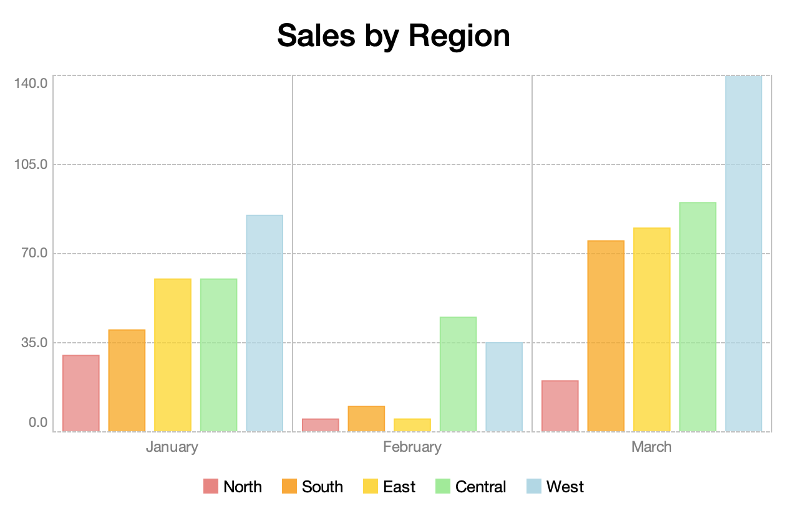
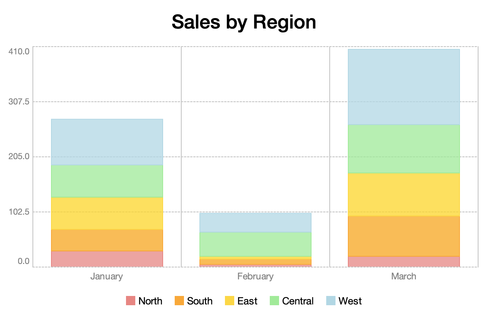
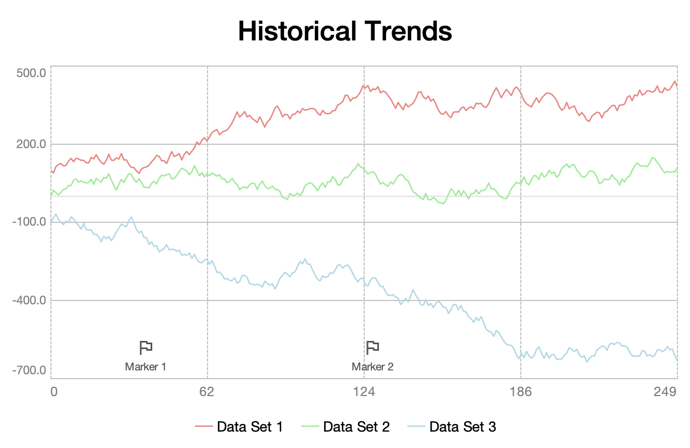
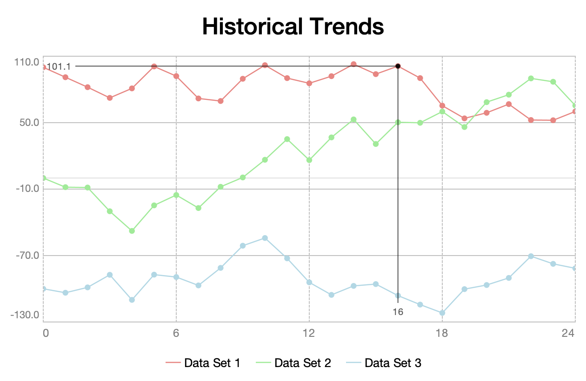
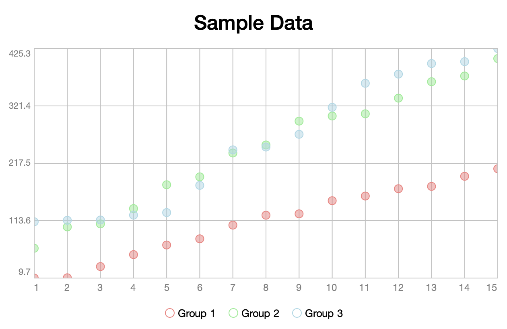
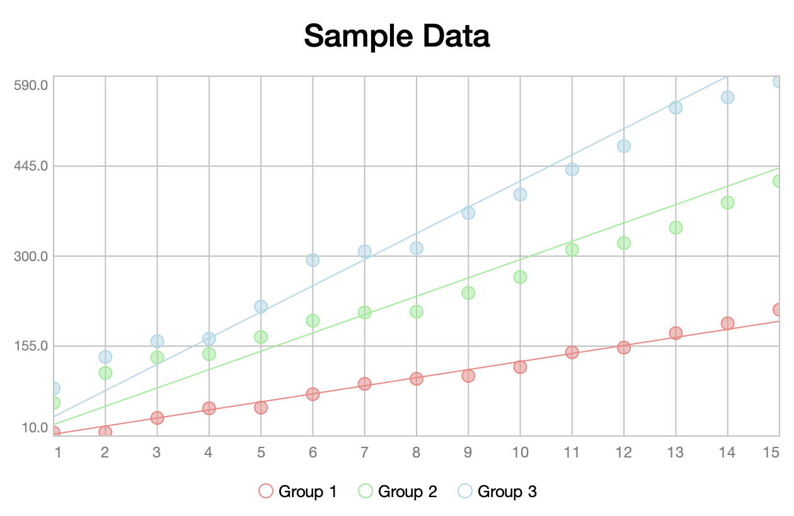

# Charts
The `org.httprpc.sierra.charts` package contains classes for producing charts. Sierra supports the following chart types:

* [Pie/Doughnut](#pie-charts)
* [Bar/Stacked Bar](#bar-charts)
* [Time Series](#time-series-charts)
* [Scatter](#scatter-charts)
* [Candlestick](#candlestick-charts)

Each is discussed in more detail below.

## Data Sets
TODO

## Legends
TODO

## Pie Charts
TODO

### Doughnut Charts
TODO 

## Bar Charts
TODO

### Stacked Bar Charts
TODO

## Time Series Charts
TODO

### Value Markers
TODO

## Scatter Charts
TODO

### Trend Lines
TODO

## Candlestick Charts
TODO

# Headless Usage
TODO
