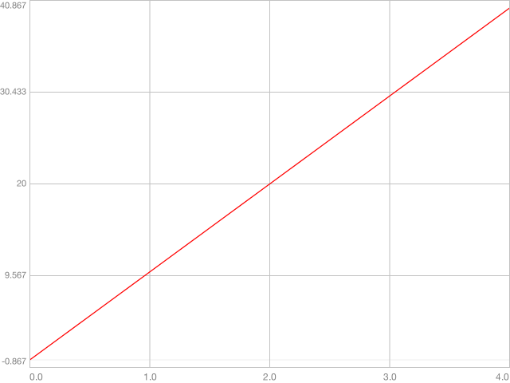
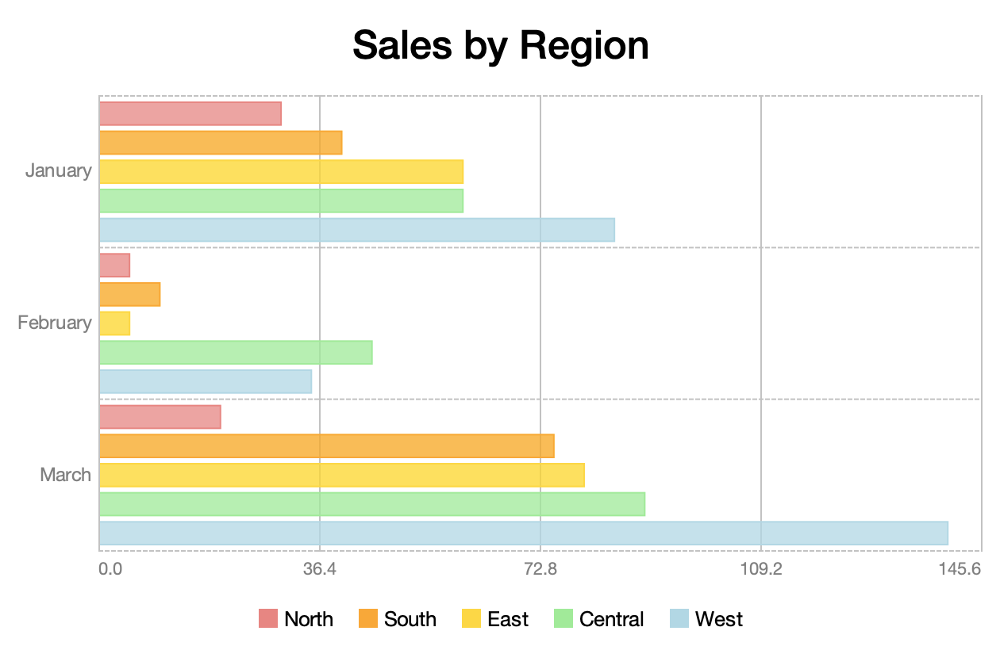
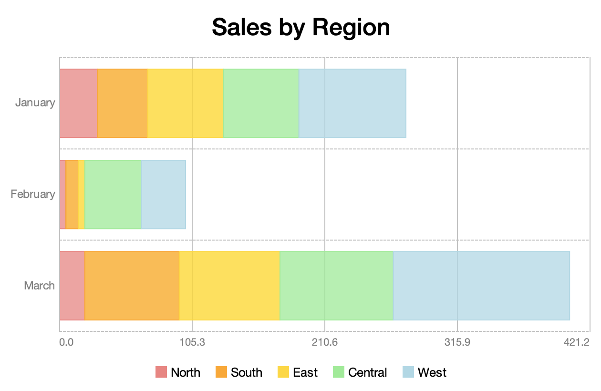

# Charts
The `org.httprpc.sierra.charts` package contains classes for producing charts. The following chart types are supported:

* [Pie/Doughnut](#pie-charts)
* [Bar/Stacked Bar](#bar-charts)
* [Time Series](#time-series-charts)
* [Scatter](#scatter-charts)
* [Candlestick](#candlestick-charts)

Each is discussed in more detail below.

## Data Sets
Instances of the `DataSet` class represent the data to be presented by a chart:

```java
public class DataSet<K extends Comparable<? super K>, V> { ... }
```

`DataSet` defines the following properties:

* "label" - a description of the data set, as a `String`
* "color" - the color associated with the data set, as a `Color`
* "stroke" - the stroke associated with the data set, as an instance of `BasicStroke`
* "dataPoints" - the data set's data points, as an instance of `SortedMap`

Map keys generally represent the chart's domain, with their associated values representing the range.

For example, this code creates a simple data set for use by a time series chart:

```java
var dataSet = new DataSet<Double, Double>("Positive Values", Color.RED);

dataSet.setDataPoints(sortedMapOf(
    entry(0.0, 0.0),
    entry(1.0, 10.0),
    entry(2.0, 20.0),
    entry(3.0, 30.0),
    entry(4.0, 40.0)
));
```

The resulting output is shown below:



## ChartPane
The `ChartPane` component displays a chart. Chart panes can be created either programmatically or declaratively. For example:

```xml
<column-panel tabTitle="Pie Chart" opaque="true" background="TextArea.background" spacing="16" padding="16">
    <label font="h1.font" text="Sales by Region" horizontalAlignment="center"/>

    <chart-pane name="pieChartPane" weight="1"/>

    <row-panel>
        <spacer weight="1"/>
        <row-panel name="pieChartLegendPanel" spacing="16"/>
        <spacer weight="1"/>
    </row-panel>
</column-panel>
```

The following code creates a pie chart and populates the associated legend panel using the labels from the chart's data set and instances of the `PieChart.LegendIcon` type:

```java
pieChartPane.setChart(createPieChart());

for (var dataSet : pieChartPane.getChart().getDataSets()) {
    pieChartLegendPanel.add(new JLabel(dataSet.getLabel(),
        new PieChart.LegendIcon(dataSet),
        SwingConstants.LEADING));
}
```

## Pie Charts
The `PieChart` class represents a pie chart:

```java
public class PieChart<K extends Comparable<? super K>, V extends Number> extends Chart<K, V> { ... }
```

The chart displays one slice per data set:


The size of each slice is determined by dividing the sum of its associated data point values by the total of all data point values across all data sets. Data point keys are ignored.

Pie charts can also be presented as a doughnut: 


## Bar Charts
The `BarChart` class displays a bar chart:

```java
public class BarChart<K extends Comparable<? super K>, V extends Number> extends CategoryChart<K, V> { ... }
```


Data point keys represent chart categories. Individual bars represent the the value associated with a given key in the corresponding data set.

Bars may optionally be stacked: 


They can also be horizontal:




## Time Series Charts
The `TimeSeriesChart` class displays a collection of values over a period of time: 

```java
public class TimeSeriesChart<K extends Comparable<? super K>, V extends Number> extends XYChart<K, V> { ... }
```

For example, this chart shows a series of `Double` values (plotted on the y-axis) collected at `Integer` intervals (plotted on the x-axis):


It also demonstrates the use of domain markers, which can be used to highlight specific data points.

Individual value markers may optionally be shown:


## Scatter Charts
The `ScatterChart` class displays the relationship between two variables:

```java
public class ScatterChart<K extends Comparable<? super K>, V extends Number> extends XYChart<K, V> { ... }
```


Data point keys represent the "independent" variable, and values the "dependent" variable.

Linear trend lines may optionally be shown to help draw a correlation between the values:


## Candlestick Charts
The `CandlestickChart` class displays a collection of OHLC (open, high, low, close) values:

```java
public class CandlestickChart<K extends Comparable<? super K>> extends CategoryChart<K, OHLC> { ... }
```

Candlestick charts are typically used to present historical pricing information. The box (or "body") represents the opening and closing values. A hollow body indicates a positive trend (a value where the closing price is higher than the opening price). A solid body represents a negative trend (a value where the closing price is lower than the opening price). The "wick" lines above and below the body represent the high and low values, respectively:


# Headless Usage
Charts can also be used in a headless environment. For example, the following code uses [Apache Batik](https://xmlgraphics.apache.org/batik/) to create an SVG representation of a chart:

```java
var domImplementation = GenericDOMImplementation.getDOMImplementation();

var document = domImplementation.createDocument("http://www.w3.org/2000/svg", "svg", null);

var svgGraphics = new SVGGraphics2D(document);

chart.draw(svgGraphics);

var writer = new StringWriter();

svgGraphics.stream(writer, false);
```
