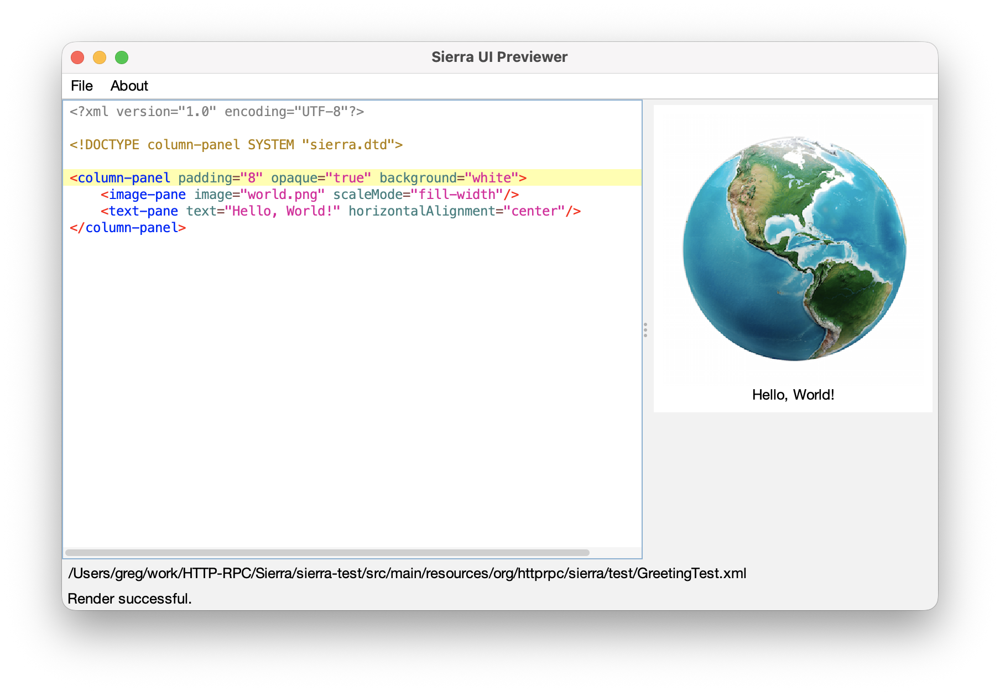

# Sierra UI Previewer
Provides a live, interactive preview of Sierra markup. Outlets and resource keys are ignored.

## Usage
```
previewer [markup-document]
```

The optional argument represents the path to the document to preview, relative to the current directory. When using this mode, the following actions are supported:

* **Control/Command-R** - refresh
* **Control/Command-P** - pack
* **Control/Command-D** - toggle dark mode

## Example
```
$ previewer
```


